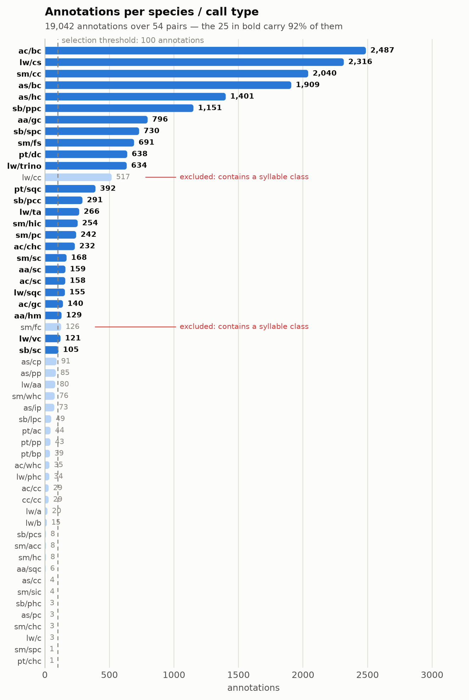
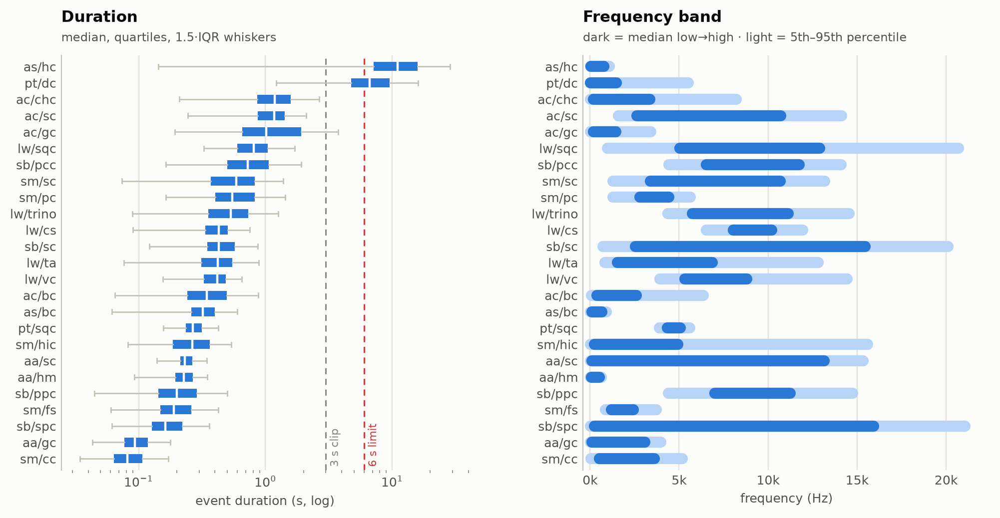
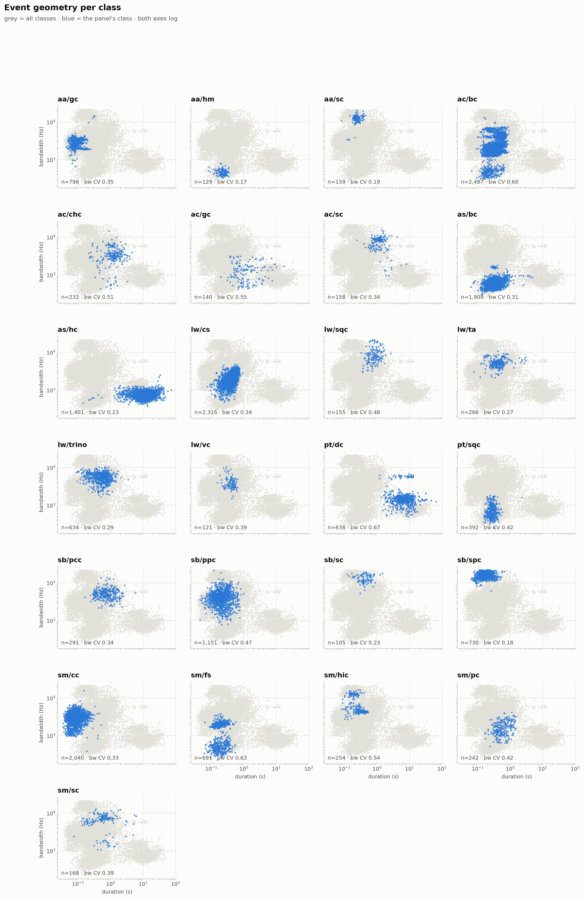
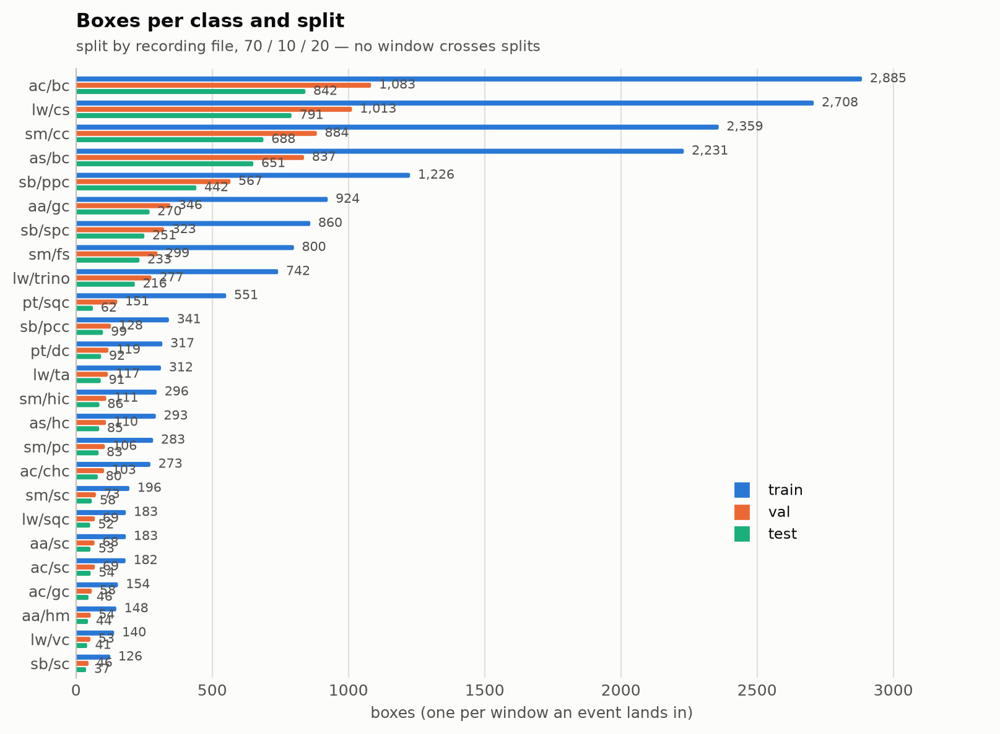
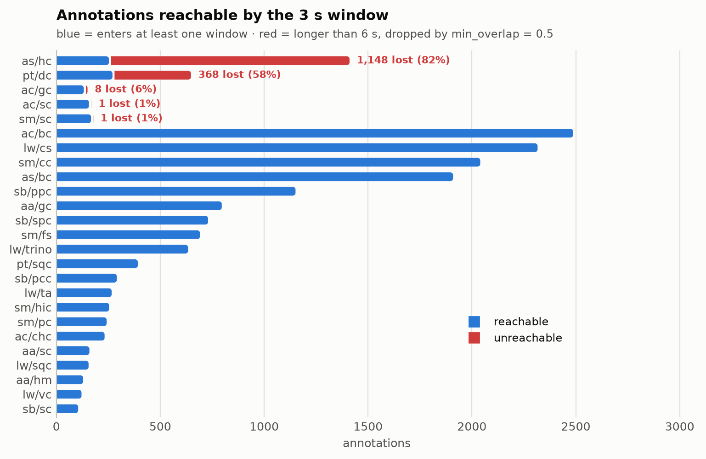
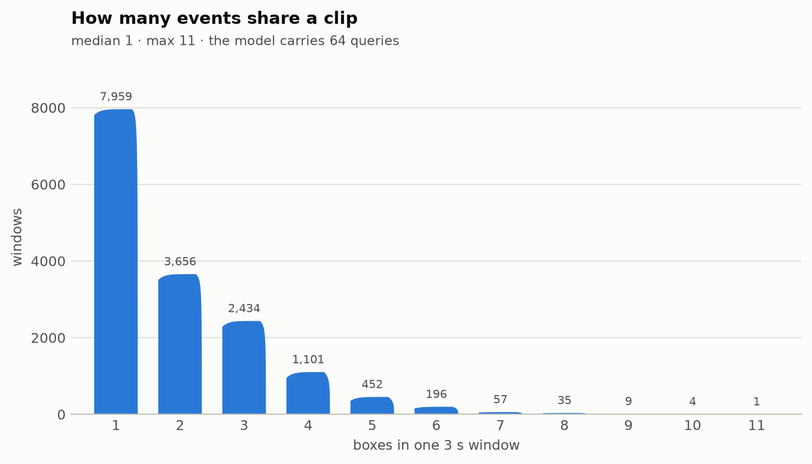
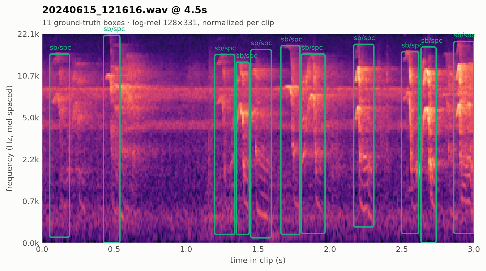
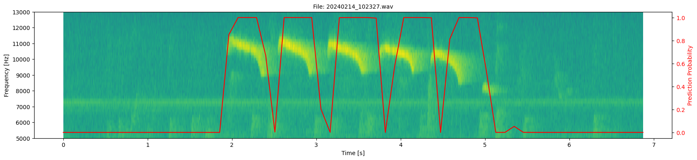
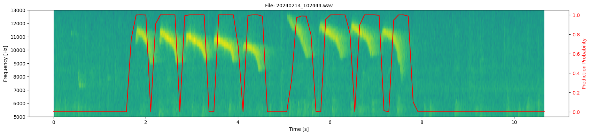
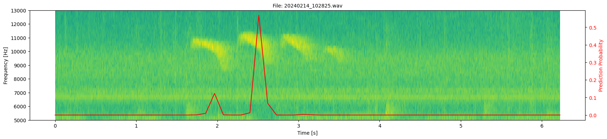

# Advancements Report - Automated Annotation of Primate Vocalizations

Fernando Nelson Candia Aroni

Advisor: Dr. Edwin Rafael Villanueva Talavera

Repository: https://github.com/nhrot-fc/tesis-primate

---

## 1. The Problem

The researchers study 8 primate species in the Peruvian Amazon, listed in Table 1.

**Table 1.** Target species. The two-letter code identifies the species throughout this
report; classes are labelled `code/call_type`.

| Code | Common name | Scientific name |
|---|---|---|
| AA | Night monkey | *Aotus azarae* |
| AC | Peruvian spider monkey | *Ateles chamek* |
| AS | Howler monkey | *Alouatta sara* |
| CC | Shock-headed capuchin | *Cebus cuscinus* |
| LW | Weddell's saddleback tamarin | *Leontocebus weddelli* |
| PT | Toppin's titi monkey | *Plecturocebus toppini* |
| SB | Bolivian squirrel monkey | *Saimiri boliviensis* |
| SM | Large-headed capuchin | *Sapajus apella macrocephalus* |

Data comes from AudioMoths deployed across the forest: non-intrusive and continuously
recording. The result is thousands of hours of audio that must be reviewed manually.

A researcher opens each file in Raven, draws a time-frequency box around every
vocalization, and labels it with a species and a call type. Recording speed exceeds
review speed by a wide margin, so most of the audio is late or never analyzed.

The deliverable is a triage tool: the model proposes regions,
an expert confirms. Missing a vocalization costs more than reviewing a false positive, so
every design choice is biased toward **recall over precision**.

The team currently uses **Arbimon** for pattern-recognition-based event retrieval, with
decent results but the syllables have variations and the tool only receives a single reference.
Additionally, the tool does not produce time-frequency box annotations with species and call type, readable back into Raven. That is the gap this work targets.

## 2. State of the Art

Detecting **time-frequency** boxes is repeatedly called
underexplored - Zhu & Sato (DCASE 2025) state that "the detection of time-frequency
bounding boxes remains largely unexplored." The mainstream bioacoustic tools support
this: BirdNET (Kahl et al., 2021) scores fixed 3 s segments and Perch 2.0
(van Merriënboer et al., 2025) is a clip-level classifier over ~14,600 species; neither
localizes calls in frequency.

Three loosely connected lines of work exist:

- **2D boxes, transformer detectors**: Zhu & Sato (DCASE 2025 Workshop)
  pair a self-supervised AST backbone (EAT) with DINO ("DETR with Improved DeNoising
  Anchor Boxes", Zhang et al., ICLR 2023), evaluated not on bioacoustics but on
  whistle sounds from defective wind-turbine blades (AP50 0.494 vs. 0.365 for a
  Faster R-CNN/ResNet baseline). Likely the first self-supervised-AST + deformable-DETR
  for 2D SED, but not the first DETR-based 2D detector: Cotillard et al. (2024, JASA)
  fine-tuned DETR on spectrograms for beluga whale calls, and SEDT/SP-SEDT
  (Ye et al., 2021) applied DETR to SED in 1D.
- **2D boxes, region-CNN / YOLO detectors**: DeepSqueak (Coffey et al., 2019,
  *Neuropsychopharmacology*) pioneered Faster R-CNN on rodent ultrasonic-vocalization
  spectrograms; extended to multi-species soundscapes (SILIC, Wu et al., 2022),
  marine mammals (Hamard et al., 2024, Faster R-CNN + FPN) and bats (Bat Detective,
  2018; BatDetect2, 2022, which predicts time, duration, frequency range and species
  per call). Most recently Hexeberg et al. (2026, arXiv:2606.10407) apply YOLO11 to
  dense tropical soundscapes (Singapore, with out-of-distribution testing on Hawaii;
  81.8% vs. 42.1% IoMin@50 F1 in-distribution) and adopt **IoMin** as a matching metric 
  tolerant of ambiguous acoustic boundaries - presented as their contribution, 
  but mathematically the Szymkiewicz-Simpson overlap coefficient,
  already used in vision as "IoM" (ReMOTS, 2020; Vogel et al., 2023). A conceptual
  precursor is Kong et al. (2019, IEEE/ACM TASLP): weakly-supervised time-frequency
  segmentation masks rather than boxes.
- **1D boxes (time only)**: YOHO (Venkatesh et al., 2022), Sound Event Bounding Boxes
  (Ebbers, Germain, Wichern & Le Roux, Interspeech 2024) and Voxaboxen (Mahon et al.,
  DCASE/NeurIPS 2025) regress onsets/offsets on the time axis; despite the "box"
  terminology they carry no frequency extent.

## 3. Old Method

The code for this stage is not in the repository, so the numbers below are
reported as recorded at the time and are not reproducible here.

Scope: **one species/call type (LW/CS).** 103
recordings, 682 annotations, fixed 0.5 s windows. Two binary classifiers: a small custom
CNN and ResNet50V2 with ImageNet weights. Both reached about **99% test accuracy**.

**Why it was abandoned.** The output is presence per window, not an event: no box, no
frequency extent, no event count, no species or call-type distinction. The accuracy is
also misleading. 91.2% of the clips are negative, so a constant "no call" predictor
already scores 91.2%, and the split was over shuffled clips, so overlapping clips from
the same annotation appeared in both train and test. Table 12 contrasts this method with
the one proposed in section 5.

## 4. Dataset

**19,029 curated annotations, 8 species, 65 distinct (species, call type) pairs.** All
Raven `.txt` files are unified into a single table by `domain/annotations.py`: call codes
normalized through a synonym map (`contact call`, `contact syllable`, `cs_a`, `CS ` →
`cs`), species taken from the source directory, high frequency clipped to the Nyquist
limit (22,050 Hz), and degenerate boxes (< 10 ms or zero bandwidth) dropped. 41 pairs
belong to the vocabulary declared in `src/domain/species.py` and are enumerated in
Table 2; the remaining 24 pairs (336 records, 1.8%) fall outside it and are flagged
`requires_review`.

### Annotated call-type vocabulary

**Table 2.** The 41 in-vocabulary (species, call type) pairs, grouped by species and
ordered by frequency. `Code` is the normalized Raven string; `Call type` the name declared
in `src/domain/species.py`. `Role` marks the 10 pairs kept for the experiment subset and
the two phrase classes excluded for nesting. Counts sum to 18,693; the remaining 336 of
19,029 are out of vocabulary.

| Species | Code | Call type | Annotations | Role |
|---|---|---|---:|---|
| AA | gc | gulp call | 799 | experiment |
| AA | sc | squeak call | 159 | tail |
| AA | hm | hoot call | 129 | tail |
| AC | bc | bark call | 2,487 | experiment |
| AC | chc | chitter call | 232 | tail |
| AC | sc | squeak call | 158 | tail |
| AC | gc | growl call | 140 | tail |
| AC | whc | whinnie call | 35 | tail |
| AC | cc | contact call | 29 | tail |
| AS | bc | bark call | 1,909 | experiment |
| AS | hc | howl call | 1,400 | experiment |
| CC | cc | contact call | 29 | tail |
| LW | cs | contact syllable | 2,282 | experiment |
| LW | cc | contact call | 536 | excluded (phrase) |
| LW | tr | trino call | 332 | tail |
| LW | ta | terrestrial alarm call | 265 | tail |
| LW | tj | unofficial tj call | 164 | tail |
| LW | sqc | squeal call | 154 | tail |
| LW | vc | visual contact call | 119 | tail |
| LW | tt | trino transition call | 106 | tail |
| LW | aa | aerial alarm call | 80 | tail |
| LW | phc | phee call | 34 | tail |
| LW | tf | trino fast call | 31 | tail |
| PT | dc | duet call | 637 | experiment |
| PT | sqc | unofficial squeal call | 392 | tail |
| PT | ac | alarm call | 44 | tail |
| PT | pp | unofficial pant phrase | 43 | tail |
| PT | bp | unofficial bellow phrase | 39 | tail |
| SB | ppc | play peep call | 1,151 | experiment |
| SB | spc | spit call | 729 | experiment |
| SB | pcc | peep contact call | 290 | tail |
| SB | sc | shriek call | 105 | tail |
| SB | lpc | long peep call | 49 | tail |
| SM | cc | contact call | 2,040 | experiment |
| SM | fs | food syllable | 691 | experiment |
| SM | hic | hip call | 254 | tail |
| SM | pc | purr call | 242 | tail |
| SM | sc | squeal call | 168 | tail |
| SM | fc | food call | 126 | excluded (phrase) |
| SM | whc | whistle call | 76 | tail |
| SM | acc | aggressive contact call | 8 | tail |

Call types labeled with "Unnoficial" are call types not found on the reference PPT, could be typos or new call types. They are not included in the experiment subset.

Two properties of Table 2 drive the rest of this section. First, the vocabulary is
uneven per species: LW carries 11 distinct call types over 4,103 annotations, while CC
contributes a single call type with only 29 annotations. Second, the distribution within a species is as
long-tailed as the distribution across species; `sm/acc` has 8 annotations against
`sm/cc`'s 2,040, a 255× spread inside one species. Figure 1 shows the same distribution
pooled across all pairs.

**Figure 1.** Annotation count per (species, call type) pair. A handful of pairs carry
most of the data

### Size variation on Calls

The calls in this dataset are very uneven in size, and that fact drives the design decisions that follow.

**Table 3.** How short or long, and how narrow or wide, the annotated calls are, measured
over all 19,029 annotations.

| | shortest | longest | ratio |
|---|---|---|---|
| Duration | 0.034 s | 73.3 s | **2,134×** |
| Bandwidth | 224 Hz | 21,784 Hz | 97× |

The longest call lasts more than 2,000 times longer than the shortest one. For comparison,
in COCO (the standard image collection used to benchmark object detectors ) the biggest
objects are only about 10 to 100 times the size of the smallest ones. 

This has two consequences. No single clip length works for every class: a window long
enough to hold a 73 s howl is far too coarse for a 34 ms chirp.

### Syllables and phrases

A *phrase* is a sequence of *syllables*, and the experts box both: 94.2% of `lw/cc`
phrases contain at least one `lw/cs` syllable, and 96.8% of `sm/fc` phrases contain an
`sm/fs` syllable. So the same audio carries one big box and several small boxes inside it.

The model cannot represent that. It returns a flat list of boxes, and training pairs each
true box with exactly one predicted box, with no way to say "this box contains that one".
Keeping both levels would mean asking the model to report the same sound twice, as two
unrelated events sitting on top of each other. The two phrase classes are therefore dropped
before training (`EXCLUDED_PAIRS` in `create_dataset.py`); they appear in Table 2 marked
*excluded (phrase)*.

### Geometric separability

**Species** separate largely by frequency band: AS sits inside ~25-1,410 Hz (1st-99th
percentile), while `lw/cs` is never annotated below 3,687 Hz. **Call types within a
species** do not separate: in LW, the `t` family plus `vc` and `cs` share band and
duration almost exactly. Figure 2 makes both effects visible at once. This is why
detection is trained class-agnostic and evaluated separately for classification.

**Figure 2.** Where each class lives in time and frequency. Species occupy distinct bands;
call types of the same species overlap almost completely - the dissociation that splits
the evaluation protocol of Table 8 into detection and classification.

Two labels are not one shape: `ac/bc` (bandwidth CV 0.60) and `sm/fs` (0.63) each split
into two clearly separated clouds in duration × bandwidth, and `sb/ppc` (0.47) is a
single diffuse smear, as shown in Figure 3. These are the classes flagged for clustering
in section 8.

**Figure 3.** Duration versus bandwidth, one panel per experiment class. The split clouds
of `ac/bc` and `sm/fs` suggest a single label covering two call variants; both are among
the worst-recall classes in Table 11.

### Experiment subset

Pairs with ≥ 500 annotations, after removing the two nesting phrases →
**10 classes, 14,125 annotations** (the rows marked *experiment* in Table 2).

Splitting is **by recording file** (`split_manifest`, seed 42), so overlapping windows
from one recording never cross splits - ratios **70 / 10 / 20**. Table 4 gives the
resulting composition.

**Table 4.** Split composition after windowing. `recordings` counts source `.wav` files,
`windows` the 3 s clips retained, `boxes` the annotation instances assigned to a window.

| split | recordings | windows | boxes |
|---|---|---|---|
| train | 1,166 | 8,022 | 16,674 |
| val | 166 | 1,043 | 2,183 |
| test | 335 | 2,490 | 5,343 |

There are more boxes than annotations because a single annotation can land in two windows:
the 3 s window advances by 1.5 s. Training boxes per class range from 3,273 (`lw/cs`) down
to 320 (`as/hc`); Figure 4 breaks the totals down by class.

**Figure 4.** Boxes per class in each split. Balance is preserved across splits, but
`as/hc` and `pt/dc` contribute far fewer boxes than their Table 2 counts suggest - the
windowing defect quantified in Table 5.

### Long events are dropped

`as/hc` and `pt/dc` produce far fewer boxes than they have annotations, and the reason is
structural. A window keeps an event only if at least `min_overlap = 0.5` of the event's
duration falls inside it, so **no event longer than 2 × 3 s = 6 s can ever be assigned to
any window**. That removes **1,514 annotations (10.7% of the experiment subset)** before
training begins, concentrated in the two classes of Table 5.

**Table 5.** Annotations made unreachable by the 3 s windowing. An event is unreachable
when it exceeds 6 s, making `min_overlap = 0.5` unsatisfiable at every window position.
No other experiment class loses a material share.

| class | annotations | unreachable (> 6 s) | share lost |
|---|---|---|---|
| as/hc | 1,400 | 1,147 | 82% |
| pt/dc | 637 | 367 | 58% |

A further 13.5% of the subset is longer than the 3 s window and survives only as a box
clipped to the window edge. Figure 5 places these losses against the classes that are
unaffected. There is no separate long-bout code path today; this is the main open item in
the preprocessing stage.

**Figure 5.** Share of annotations each class can contribute under the 3 s windowing. For
`as/hc` most of the label is invisible to training, capping its recall in Table 11
regardless of model capacity.

## 5. New Method

**Audio Spectrogram Transformer (AST) backbone + Deformable DETR decoder.** In four steps:

1. The audio is turned into a log-mel spectrogram - an image with time on one axis and
   frequency on the other, exactly what the analyst sees in Raven.
2. A **frozen AST** pretrained on AudioSet converts that image into features, and a
   ViTDet-style pyramid rebuilds them at four resolutions, so both a 34 ms chirp and a
   3 s bout are visible at some scale - the range documented in Table 3.
3. A **Deformable DETR decoder** carries 64 learnable queries. Each query attends to a few
   sampled points of the pyramid and emits one candidate event.
4. During training, **Hungarian matching** pairs every true annotation with exactly one
   query. The model therefore learns to output a *set* of events directly - no anchors,
   no NMS inside a clip, no post-hoc peak picking.

Each prediction is a tuple `(t_start, t_end, f_low, f_high, species, call_type, score)` -
exactly what an analyst draws in Raven, so predictions are written back as a selection table.

**88.9 M parameters total, of which 3.1 M are trainable** (dim 128, 64 queries, 10
classes); the 85.8 M AST parameters are frozen.

### Preprocessing

**Table 6.** Preprocessing parameters, as set in `Parameters` (`src/core/config.py`). The
rationale column records what failed at the alternative setting.

| Parameter | Value | Rationale |
|---|---|---|
| Clip / hop | 3.0 s / 1.5 s | Fits 8 of the 10 classes; see the long-event defect in Table 5 |
| `min_overlap` | 0.5 | An event enters a window only if half its duration is inside |
| `win_length` | 1024 (23 ms) | Shorter than the shortest events (34 ms min, 81 ms median for `sm/cc`) |
| `n_fft` | 4096 | Zero-padding only: densifies the frequency grid without touching temporal resolution |
| `hop_length` | 400 (9 ms) | Gives 331 frames per clip |
| `n_mels` | 128 | What AST expects; 256 gave no measurable gain |
| `f_min` / `f_max` | 25 Hz / 22,050 Hz | `f_max` at 16 kHz was truncating half of `sb/spc`'s boxes (mean high freq 16,110 Hz) |

Boxes are normalized to `cxcywh` in `[0,1]`, with the frequency axis mapped through the
HTK mel scale (`hz_to_y`), so a box means the same thing in pixel space as on screen.
Figure 7 shows the result for one window.

### Architecture decisions

**Table 7.** Deviations from the base Deformable DETR recipe, each with the failure it
addresses. Their cumulative effect is measured in Table 10.

| Decision | Justification |
|---|---|
| AST frozen | Using pretrained weights avoids the need to train from scratch |
| `time_stride` 10 → 5 | The shortest events are  34 ms. Each token is now 45 ms instead of 91 ms. The model can now better localize shorter events. |
| Zhu et al. attention init | Sampling offsets start on a radial grid instead of noise |
| Iterative box refinement + auxiliary losses | Six decoder layers were sharing one fixed reference point |
| True multi-scale sampling | Feature map 12×64 → pyramid 48×256, 24×128, 12×64, 6×32; each level is sampled separately |
| `n_queries` = 64 | At most 11 boxes land in one clip (median 2, Figure 6); 100 queries produced prediction noise |

**Figure 6.** Annotation boxes per 3 s window: median 2, maximum 11. This is the basis for
the query budget of 64 in Table 7 - well above the worst case, without inviting spurious
predictions.

**Figure 7.** One training window as the model receives it: a 3 s log-mel spectrogram
(parameters of Table 6) with the target boxes overlaid in the normalized `cxcywh` frame.

### Evaluation protocol

Three failure modes are measured separately, because they have different fixes.

**Table 8.** Evaluation protocol. The three tasks are scored independently so a drop points
at a specific stage: detection is a recall problem, framing a regression problem,
classification a feature problem. Table 9 follows this decomposition.

| Task | Question it answers | Metric |
|---|---|---|
| Detection | Did we find the event at all? | class-agnostic recall @ IoU 0.5, score threshold 0.5 |
| Framing | Is the box drawn tightly around it? | mean IoU over matched pairs, plus AP @ {0.25, 0.30, 0.50, 0.75} |
| Classification | Is the label right? | accuracy over matched pairs |

Plus **FP/TP at the operating point**, which is the human review burden - the number the
domain expert has to approve. Checkpoint selection maximizes an F-β with β = 3, i.e. it
weights recall nine times more than precision, per the operating requirement in section 1.

All reported metrics use plain IoU. IoMin (Hexeberg et al.) is implemented in
`architectures/iou.py` and selectable as the matcher/loss criterion, but is not yet
reported alongside IoU; doing so would quantify annotation-boundary ambiguity. GIoU and
EIoU were implemented and removed - EIoU is unbounded below zero and not comparable to
published work.

Per-file inference (`pipelines/inference_pipeline.py`) does apply class-wise NMS at
IoU 0.3, but only to merge duplicate detections of the same event across the overlapping
sliding windows - not to resolve predictions within a clip.

## 6. Results

**Table 9.** Validation-set performance of `128d_64q_iouiou_10cls`, along the three axes of
Table 8. `FP/TP` is measured at the operating point (score threshold 0.5) and is the
review burden the expert experiences directly.

| Axis (per Table 8) | Metric | Value |
|---|---|---:|
| Detection | class-agnostic recall @ IoU 0.50 | 0.767 |
| Detection | FP/TP at the operating point | 1.12 |
| Framing | mean IoU over matched pairs | 0.659 |
| Framing | class-agnostic AP @ 0.25 | 0.803 |
| Framing | class-agnostic AP @ 0.50 | 0.648 |
| Framing | class-agnostic AP @ 0.75 | 0.133 |
| Classification | accuracy over matched pairs | 0.982 |

Out of every 10 vocalizations, the model proposes about **8**; the expert
discards roughly **one wrong proposal per correct one**; and when a proposal is correct,
its species and call type are right **98%** of the time. What it does not yet do well is
draw the box tightly. That is the AP@0.75 = 0.133 figure.

### On real recordings

Figures 8-14 use the same audio files for both models, so they can be read side by side:
Figure 9 and Figure 11 are the same recording, and Figure 10 and Figure 12 are the same
recording.

**Old model** - a probability curve per window (Figures 8-10):

**Figure 8.** Old classifier on `20240214_102327.wav`. The red curve is per-window call
probability. It rises on the six LW/CS syllables, but the output is a curve, not events:
no box, no frequency extent, no class, and a syllable count only where the curve dips back
to zero.

**Figure 9.** Old classifier on `20240214_102444.wav`. Ten syllables, curve saturated at
1.0 through most of the bout; where it fails to return to zero, adjacent syllables merge
into one detected region. Compare Figure 11, same recording under the new model.

**Figure 10.** Old classifier on `20240214_102825.wav`, a quieter recording of the same
call type. Probability barely exceeds 0.55 and peaks once, between two syllables: four
visible LW/CS calls are effectively missed. Figure 12 shows the same file under the new
model.

**New model** - a set of labelled boxes (Figures 11-14):

**Figure 11.** New model on `20240214_102444.wav`, the recording of Figure 9. Each of the
ten LW/CS syllables comes back as its own box with class and confidence (mostly 1.00). The
harmonic arcs above 17 kHz are correctly left unboxed.

**Figure 12.** New model on `20240214_102825.wav`, the recording the old classifier
missed in Figure 10. All four LW/CS syllables are found with confidence ≥ 0.99, despite
the strong broadband noise floor below 7 kHz.

**Figure 13.** New model on `20240214_102900.wav`, with heavy rain/insect streaks. Four
LW/CS syllables near 10 kHz plus one AS/BC event below 1 kHz at ~3.9 s - two species in
different bands retrieved in the same pass, the separability of Figure 2 at inference
time.

**Figure 14.** New model on `20240217_090423.wav`, seconds 45-50: three species (SB/PPC,
LW/CS, AC/BC) overlapping, some events cut at the segment edge. Confidences spread
(0.23-0.97) and box edges are loose - in this dense regime framing, not detection, is the
bottleneck, consistent with the AP@0.75 of Table 9.

### Progression

**Table 10.** Effect of the architecture changes of Table 7 on class-agnostic AP, each row
cumulative over the one above. `epochs` is where the reported checkpoint was selected. Bold
marks the configuration of Table 9.

| Configuration | AP@0.25 | AP@0.50 | AP@0.75 | epochs |
|---|---|---|---|---|
| Base Deformable DETR | 0.609 | 0.325 | 0.037 | 30 |
| + attention init, iterative refinement, aux losses | 0.742 | 0.569 | 0.112 | 75 |
| **+ IoU in matcher and loss** | **0.803** | **0.648** | **0.133** | **20** |

The last change improved every threshold while cutting training to a quarter of the
epochs.

### Per-class recall

**Table 11.** Class-agnostic detection recall @ IoU 0.5 by ground-truth class, for the
configuration of Table 9. `note` attributes each shortfall to a cause established earlier:
unreachable long events (Table 5), geometric heterogeneity (Figure 3), or nesting (section 4).

| class | recall | note |
|---|---|---|
| aa/gc | 0.891 | |
| as/bc | 0.883 | |
| lw/cs | 0.851 | |
| as/hc | 0.762 | only 253 of 1,400 annotations are reachable; the rest exceed 6 s (Table 5) |
| sm/cc | 0.721 | 81 ms median duration |
| sb/ppc | 0.689 | geometrically heterogeneous (bandwidth CV 0.47, Figure 3) |
| pt/dc | 0.649 | only 270 of 637 annotations are reachable (Table 5) |
| sm/fs | 0.622 | nested inside `sm/fc`, which is excluded (Table 2) |
| sb/spc | 0.556 | its band spans 249-15,931 Hz and swallows several other classes |
| **ac/bc** | **0.473** | **heterogeneous (bandwidth CV 0.60, Figure 3), worst despite 3,001 training boxes** |

## 7. Comparison with the proof of concept

**Table 12.** The proof-of-concept classifier of section 3 against the detection model of section 5, on
the properties that determine whether the output is usable as a Raven annotation. The two
are not comparable on a single metric, hence two quantities in the metric row.

| | Old (POC classifier) | New (AST + Deformable DETR) |
|---|---|---|
| Task | Binary classification per 0.5 s window | Set detection over a 3 s spectrogram |
| Labels | LW only, call type merged into one positive class | 7 species × call type (10 classes) |
| Output | Presence probability | Boxes (time *and* frequency) + class + confidence |
| Overlapping calls | Not separable | Separable; event count is native |
| Metric | Clip accuracy (91.2% baseline) | Event-level recall / FP-TP at IoU, per class |
| Raven export | Not accurately implemented | Implemented |

## 8. Next Steps

**In progress**

1. **Long-event handling.** 10.7% of the experiment subset is unreachable under the
   current windowing (Table 5). Either a second, coarser clip length for `as/hc` and
   `pt/dc`, or a relaxed `min_overlap` with edge-clipped boxes.
2. **Data augmentation.** Random temporal offset in windowing (targets position
   memorization), gain jitter ±10 dB, box jitter ±15% relative to size, and background
   mixing from unannotated segments of the team's own recordings.

**Requires the research team**

3. **Expert review of high-confidence false positives.** 48.9% of them fall on regions
   with no annotation at all. Whether these are noise or unannotated events changes the
   interpretation of every precision figure in Table 9.
4. **Inter-annotator agreement.** Two experts annotating the same recordings gives the
   achievable performance ceiling, which is what separates "the model fails" from "the
   task has a limit". Currently unmeasured.
5. **Cluster `ac/bc` and `sb/ppc` geometry.** If two or three clean modes appear
   (Figure 3), the label groups distinct call variants - a finding about the annotation
   scheme rather than the model.
6. **Extend the label set beyond the 10 experiment classes** of Table 2. 29 in-vocabulary
   call types are currently unused, and 24 out-of-vocabulary pairs (336 records) are
   pending curation.
7. Benchmark against Arbimon on the same recordings.
