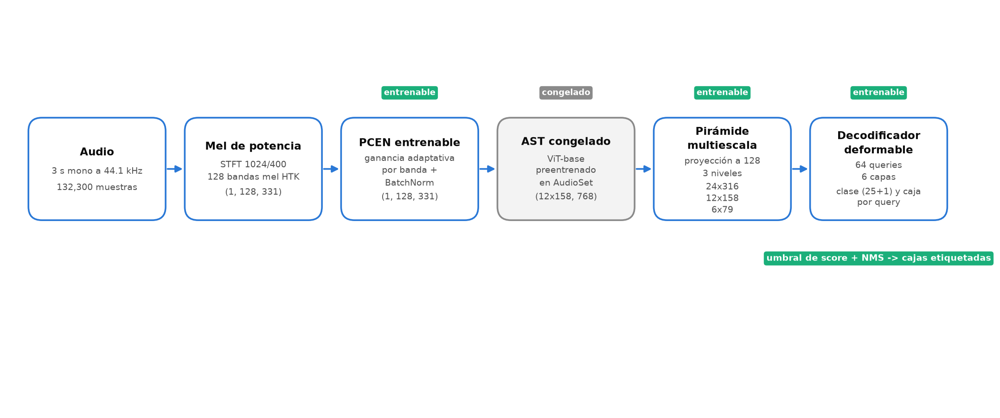
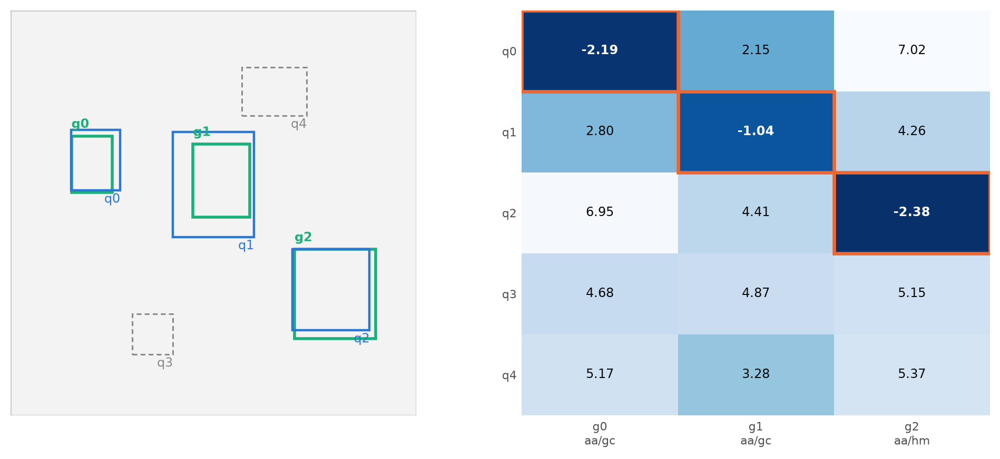
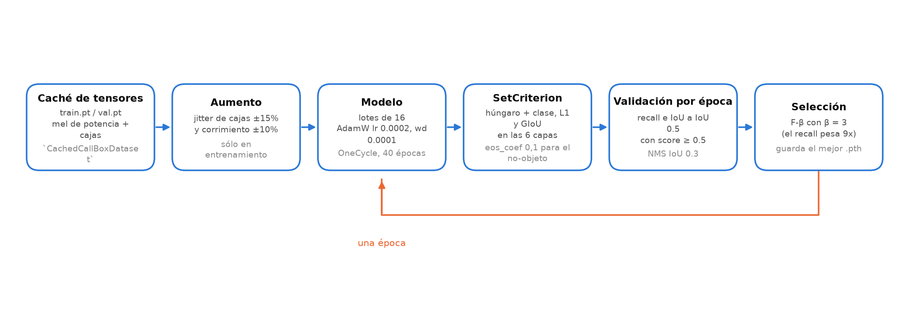
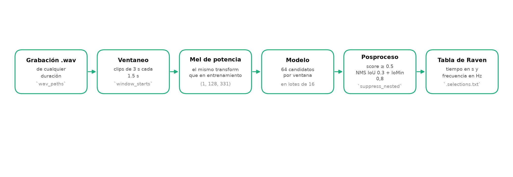

# Diseño, pipeline reproducible y modelo del detector (OE2)

**Objetivo específico 2.** Diseñar, entrenar y evaluar un detector de eventos
tiempo--frecuencia que devuelva, para cada vocalización, su caja, su especie y su tipo de
llamada.

**Estado de los resultados de OE2 al 21 de agosto de 2026**

| RE | Resultado esperado | Estado | Sección |
|---|---|---|---|
| RE2.1 | Diseño experimental, arquitectura propuesta y línea base | Arquitectura e hiperparámetros implementados y documentados; **la línea base sigue sin declararse** | [§2](#2-re21-arquitectura-e-hiperparámetros) |
| RE2.2 | Pipeline reproducible de entrenamiento, evaluación e inferencia | Completo y ejecutable de punta a punta | [§3](#3-re22-pipeline-reproducible) |
| RE2.3 | Informe comparativo de resultados | **Pendiente**: hay métricas de validación en los *checkpoints*, no hay corrida sobre `test` ni comparación | [§4](#4-re23-estado-de-los-resultados) |
| RE2.4 | Modelo final cargable y demostración funcional | Verificado: el *checkpoint* carga y produce una tabla de Raven | [§5](#5-re24-modelo-cargable-y-demostración-funcional) |
| RE2.5 | Código y modelo disponibles en un repositorio | El código está publicado; **falta decidir la publicación de los pesos** | [§6](#6-re25-publicación) |

Este documento describe lo que el código hace hoy, con las cifras medidas sobre el
repositorio, y separa de forma explícita lo verificado de lo pendiente. El conjunto de
datos que consume está documentado en [`RE1_dataset_curado.md`](RE1_dataset_curado.md).

---

## 1. Formulación de la tarea

El sistema recibe una ventana de 3 s representada como espectrograma mel de potencia de
128 × 331 y devuelve un **conjunto** de a lo sumo 64 elementos; cada uno es una tupla

```
(cx, cy, w, h, clase, puntuación)
```

donde `(cx, cy, w, h)` está normalizado en `[0, 1]²` —tiempo dividido por la longitud del
clip, frecuencia en el eje mel de `hz_to_y`— y `clase` es una de las 25 combinaciones
`especie/tipo_de_llamada` o el canal de **no-objeto**.

Que la salida sea un conjunto y no una rejilla es la decisión de partida: no hay anclas,
no hay supresión no máxima dentro del entrenamiento y el número de eventos por ventana
—mediana 1, máximo observado 11— lo decide el modelo, no una plantilla. El precio es que
el entrenamiento necesita un emparejamiento explícito entre predicciones y anotaciones
(§2.7).

El sesgo operativo es **recall sobre precisión**: perder una vocalización cuesta más que
revisar un falso positivo, porque el sistema es una herramienta de triaje que el analista
confirma. Ese sesgo está codificado, no solo declarado, en el criterio de selección de
*checkpoint* (§3.3).

---

## 2. RE2.1: arquitectura e hiperparámetros

### 2.1 Vista general

```
mel de potencia (B, 1, 128, 331)
      │
      ├─ TrainablePCEN(n_mels=128)              512 parámetros entrenables
      ├─ BatchNorm2d(1, affine=False) / 2
      │
      ├─ ASTBackbone  (MIT/ast-finetuned-audioset-10-10-0.4593, congelado)
      │      pos-embed reinterpolado en tiempo, time_stride 2
      │      salida: (B, 12·158, 768) sin los tokens CLS y de destilación
      │
      ├─ Linear(768 → 128) y reordenamiento a (B, 128, 12, 158)
      ├─ MultiScalePyramid(n_levels=3)
      │      nivel 0  (B, 128, 24, 316)    columna = 9,5 ms
      │      nivel 1  (B, 128, 12, 158)    columna = 19,0 ms
      │      nivel 2  (B, 128,  6,  79)    columna = 38,0 ms
      │
      └─ DeformableDETR(dim=128, n_queries=64, 6 capas)
             pred_logits (B, 64, 26)   ← 25 clases + no-objeto
             pred_boxes  (B, 64,  4)
             aux_outputs: las 5 capas intermedias, con la misma forma
```



**Figura 1.** Arquitectura. Solo los bloques marcados como entrenables reciben gradiente.

### 2.2 PCEN entrenable

`TrainablePCEN` implementa la normalización de energía por canal de Lostanlen et al. con
sus cuatro parámetros **aprendidos por banda mel**:

```
M    = suavizado exponencial de x con coeficiente s        (por banda)
AGC  = x / (ε + M)^α                                        control de ganancia
PCEN = (AGC + δ)^r − δ^r                                     compresión de rango
```

| Parámetro | Inicialización | Parametrización | Rango efectivo |
|---|---:|---|---|
| `s` (suavizado) | 0,025 | `sigmoid(s_raw)` | `(0, 1)` |
| `α` (ganancia) | 0,98 | `sigmoid(alpha_raw)` | `(0, 1)` |
| `δ` (sesgo) | 2,0 | `softplus(delta_raw)` | `(0, ∞)` |
| `r` (compresión) | 0,5 | `sigmoid(r_raw)` | `(0, 1)` |

Son 4 × 128 = **512 parámetros**. El suavizado exponencial se calcula en el dominio
logarítmico con `logcumsumexp`, no con un bucle recurrente: sobre 331 columnas, el bucle
haría el grafo de autograd 331 pasos más profundo y el cálculo, secuencial. La forma
logarítmica es además la que evita el subdesbordamiento cuando `(1−s)^k` se hace diminuto.

Esta capa es la que sustituye a la compresión logarítmica del espectrograma: por eso el
conjunto derivado guarda un mel **de potencia sin comprimir** (véase `RE1_dataset_curado.md`, §4.5).
Que la compresión sea aprendida y no fija es la respuesta al ruido no estacionario del
bosque —insectos, lluvia, viento— que un `log` fijo trata igual que a la señal.

La `BatchNorm2d(1, affine=False)` posterior, dividida por 2, lleva la salida al rango que
el AST espera de su entrada normalizada.

### 2.3 Backbone AST congelado

`ASTBackbone` carga el *Audio Spectrogram Transformer* preentrenado en AudioSet
(`MIT/ast-finetuned-audioset-10-10-0.4593`) desde una copia local en
`checkpoints/hf/`, y solo lo descarga si esa copia falta.

Dos adaptaciones son necesarias porque el AST fue entrenado con entradas de 1 024
columnas y este proyecto usa 331:

1. **Reinterpolación del *positional embedding*.** Los embeddings de parche se
   reorganizan a `(1, freq_out, time_out_original, C)` y se interpolan bilinealmente al
   nuevo `time_out`. Los dos tokens especiales (CLS y destilación) se conservan intactos.
2. **Cambio del paso temporal.** `time_stride` pasa de 10 a **2**, lo que multiplica por
   cinco la resolución temporal de los tokens: con parches de 16 y paso 2,
   `time_out = (331 − 16) // 2 + 1 = 158`, mientras que `freq_out = (128 − 16) // 10 + 1 = 12`.
   Ambos son pares, condición que `MultiScalePyramid.check_input_size` exige para que el
   nivel de submuestreo no descarte una fila o columna y desalinee los niveles entre sí.

El AST se congela salvo la proyección de parches
(`embeddings.patch_embeddings.projection`), que sí recibe gradiente: es la capa que ve la
entrada de un solo canal proveniente del PCEN, y dejarla fija obligaría al PCEN a producir
exactamente la estadística de AudioSet. `ASTBackbone.train()` mantiene el modelo en modo
`eval` aunque el resto de la red esté entrenando, para que las capas de normalización del
AST no actualicen sus estadísticas.

El `forward` del *backbone* **no** usa `no_grad`: los pesos congelados ya tienen
`requires_grad=False`, y cortar el grafo ahí impediría que el gradiente llegue al PCEN,
que está aguas arriba y sí se entrena.

### 2.4 Pirámide multiescala

`MultiScalePyramid` reconstruye tres resoluciones a partir del único mapa de tokens del
AST: una transpuesta que duplica, la identidad y una convolución con paso 2. Con la
ventana de 3 s, la columna de cada nivel cubre 9,5, 19,0 y 38,0 ms respectivamente.

La justificación es la geometría del conjunto: las duraciones medianas de las clases van
de 81 ms (`sm/cc`) a 11 s (`as/hc`), un rango que ningún nivel único resuelve. La atención
deformable consulta los tres niveles con la misma consulta y aprende con qué peso
combinarlos.

### 2.5 Decodificador deformable

Seis capas idénticas, cada una con auto-atención entre consultas, atención deformable
sobre la pirámide y una red *feed-forward*:

| Componente | Configuración |
|---|---|
| Consultas | 64, con dos embeddings: contenido (`query_embed`) e identidad (`query_pos`) |
| Cabezas | 8 |
| Puntos de muestreo | 4 por nivel y por cabeza → 4 × 3 × 8 = 96 por consulta y capa |
| Dimensión FFN | 1 024 |
| *Dropout* | 0,1 |
| Normalización | `LayerNorm` posresidual, tres por capa |

Tres detalles del muestreo importan y están implementados:

- **Los desplazamientos se miden en fracciones de la caja de referencia**, no del mapa de
  características: `sample = ref_xy + offs / n_points · ref_wh · 0,5`. Sin eso, una
  consulta que sigue una llamada de 2 s inspeccionaría la misma vecindad de cuatro
  píxeles que una de 50 ms. Es lo que permite atender con el mismo mecanismo a eventos de
  escalas muy distintas.
- **La inicialización de los desplazamientos es la rejilla radial de Zhu et al.**: cada
  cabeza mira en una dirección y cada punto a un radio mayor, en vez de ruido. Los pesos
  de atención se inicializan en cero, de modo que la primera capa promedia uniformemente.
- **`query_pos` se vuelve a sumar en cada capa**, a la consulta y a la clave. Sin eso, la
  identidad de cada consulta se diluye en los residuales después de la primera capa y
  todas tienden a mirar lo mismo.

**Refinamiento iterativo de la caja.** La caja de referencia arranca en
`(sigmoid(Linear(query_pos)), 0.1, 0.1)` y cada capa predice un delta en espacio *logit*
sobre la caja de la capa anterior. Entre capas la caja se separa del grafo con `detach`:
la capa siguiente muestrea sobre ella, pero no retropropaga a través de ella.

Cada una de las seis capas tiene su propia cabeza de clase (`Linear(128, 26)`) y su propia
cabeza de caja (MLP de tres capas). La salida del modelo es la de la última capa; las
cinco anteriores viajan en `aux_outputs` y alimentan las pérdidas auxiliares.

### 2.6 Presupuesto de parámetros

| Bloque | Parámetros | Entrena |
|---|---:|:---:|
| AST preentrenado (sin la proyección de parches) | 86,52 M | no |
| Proyección de parches del AST | 0,20 M | sí |
| PCEN entrenable | 512 | sí |
| Proyección, pirámide y decodificador | 2,87 M | sí |
| **Total** | **89,58 M** | **3,07 M entrenables** |

Solo el 3,4 % de los parámetros recibe gradiente. Es lo que hace viable entrenar sobre
17 381 ventanas sin sobreajustar de inmediato, y lo que reduce el *checkpoint* a 12 MB:
el AST congelado no se guarda, se reconstruye desde la copia local al cargar (§5.2).

### 2.7 Pérdida y emparejamiento

**`HungarianMatcher`** resuelve, sin gradiente, la asignación uno a uno entre las 64
consultas y las anotaciones de cada ventana, minimizando

```
coste = 1,0 · (−p(clase verdadera))  +  5,0 · ‖caja_pred − caja_ref‖₁  +  2,0 · (−GIoU)
```

con `scipy.optimize.linear_sum_assignment` sobre la submatriz de cada elemento del lote.

**`SetCriterion`** calcula, sobre esa asignación:

| Término | Fórmula | Peso |
|---|---|---:|
| `loss_cls` | Entropía cruzada sobre las 26 clases, con peso `eos_coef = 0,1` en el canal de no-objeto | 1,0 |
| `loss_bbox` | `L1` sobre las cajas emparejadas, normalizada por el número de anotaciones del lote | 5,0 |
| `loss_iou` | `generalized_box_iou_loss` sobre las mismas, normalizada igual | 2,0 |

Las consultas sin pareja se entrenan contra el canal de no-objeto; el peso 0,1 evita que
esa mayoría domine el gradiente, ya que con 64 consultas y una mediana de una anotación
por ventana, el 98 % de las consultas es no-objeto.

`loss_total` es la suma ponderada, y el `forward` la **acumula sobre las seis cabezas**:
la de salida más las cinco auxiliares. Cada capa intermedia recibe así una señal directa,
que es lo que permite entrenar seis capas de decodificador sin que las primeras queden a
ciegas.



**Figura 2.** Emparejamiento húngaro. La asignación es uno a uno y las consultas sin
pareja se entrenan contra el no-objeto.

### 2.8 Puntuación y posprocesamiento

`predict_scores` define la puntuación de una consulta como la **probabilidad máxima entre
las 25 clases reales**, descartando el canal de no-objeto:

```python
prob = pred_logits.softmax(-1)
scores, labels = prob[..., :-1].max(-1)
```

No se usa `1 − p(no-objeto)`: una consulta indecisa, con softmax casi uniforme, daría
`1 − 1/26 = 0,96` y pasaría cualquier umbral, y ese valor crecería con el número de
clases.

`suppress_nested` aplica dos supresiones en cascada sobre las cajas que superan el umbral:

1. **NMS por clase** (`batched_nms`) con IoU 0,3.
2. **Supresión de anidamiento**: entre las supervivientes de la misma clase, se elimina la
   que quede contenida en otra con IoMin > 0,8, donde
   `IoMin = intersección / min(área₁, área₂)`.

El segundo paso existe porque el IoU clásico no reconoce el anidamiento: una caja pequeña
dentro de una grande tiene IoU bajo y sobrevive al NMS, aunque describa el mismo evento
dos veces. Es el mismo criterio que la literatura reciente de detección bioacústica adopta
como métrica de emparejamiento tolerante a fronteras ambiguas.

### 2.9 Hiperparámetros de la corrida

Todos están declarados como constantes en `src/train.py` y se copian dentro del
*checkpoint* y de `logs/<fecha>/config.json`.

| Grupo | Parámetro | Valor |
|---|---|---:|
| Arquitectura | `MODEL_DIM` | 128 |
| | `N_QUERIES` | 64 |
| | `N_LEVELS` | 3 |
| | `time_stride` | 2 |
| Optimización | Optimizador | AdamW |
| | `LEARNING_RATE` (máximo del ciclo) | 2 × 10⁻⁴ |
| | `WEIGHT_DECAY` | 10⁻⁴ |
| | Planificador | `OneCycleLR`, `pct_start` 0,05, coseno |
| | `EPOCHS` | 40 |
| | `BATCH_SIZE` | 16 |
| | Recorte de gradiente | norma 0,1 |
| Aumento | `BoxJitter(scale, shift, min_size)` | 0,15 / 0,10 / 0,02 |
| Evaluación | `METRIC_IOU_THRESHOLD` | 0,5 |
| | `OPERATING_SCORE_THRESHOLD` | 0,5 |
| | `NMS_IOU` | 0,3 |
| | IoMin de anidamiento | 0,8 |
| | `CHECKPOINT_SELECTION_BETA` | 3,0 |
| Reproducibilidad | `SEED` | 42 |

El planificador se dimensiona con `total_steps = EPOCHS · len(train_loader)` y avanza
**por paso**, no por época.

### 2.10 La línea base: decisión pendiente

El IOV de RE2.1 exige «definir la comparación con la línea base declarada», y **esa
declaración todavía no está hecha**. El material disponible para sostenerla es:

| Candidato | Qué es | Estado |
|---|---|---|
| Prototipo YOLOv2 con anclas | Anclas por K-Means sobre `(duration_s, bandwidth_hz)`, `k = 5` por par, tensor objetivo `S × S × k × (5+C)`; documentado en el informe E3 | El código no está en el repositorio; habría que reimplementarlo |
| Clasificador binario por ventana | CNN y ResNet50V2 sobre ventanas de 0,5 s, una sola clase (`lw/cs`) | Métricas no reproducibles y partición con fuga; sirve como iteración descartada, no como línea base |
| Ablación interna | `128d_16q_25cls_best.pth` (16 consultas) frente a `128d_64q_25cls_best_2.pth` (64), mismo conjunto y mismo protocolo | **Disponible y comparable**: es la única comparación que hoy puede ejecutarse sin escribir código nuevo |

La comparación con una línea base externa exige una decisión previa —recuperar el
prototipo YOLOv2 como línea base o declararlo iteración descartada— que corresponde a la
dirección del trabajo. Mientras no se tome, RE2.1 queda cumplido en arquitectura e
hiperparámetros y **abierto en el eje de comparación**.

---

## 3. RE2.2: pipeline reproducible

### 3.1 Mapa de módulos

| Ruta | Responsabilidad |
|---|---|
| `src/core/config.py` | `Parameters` (audio y ventaneo) y `Settings` (rutas, `HF_TOKEN`, nivel de log) |
| `src/core/setup.py` | Logging a consola y a archivo; raíz del proyecto |
| `src/domain/annotations.py` | Curación de las tablas de Raven (RE1.1) |
| `src/domain/species.py` | Vocabulario del dominio y `LabelSet` |
| `src/domain/dataset.py` | Ventaneo, partición, `CallBoxDataset`, `CachedCallBoxDataset`, `BoxJitter`, `collate_fn` |
| `src/domain/raven.py` | Columnas exactas de una tabla de selección de Raven |
| `src/utils/audio.py` | Lectura de clips, relleno, escala mel, `hz_to_y` / `y_to_hz`, `MelSpectrogram` |
| `src/architectures/trainable_pcen.py` | PCEN con parámetros aprendidos por banda |
| `src/architectures/backbone.py` | `ASTBackbone` y `MultiScalePyramid` |
| `src/architectures/deformable_detr.py` | Decodificador deformable, `ASTDeformableDETR`, `predict_scores`, `postprocess` |
| `src/architectures/criterion.py` | `HungarianMatcher` y `SetCriterion` |
| `src/architectures/iou.py` | `box_iou_pairwise`, `min_area_box_iou`, `suppress_nested` |
| `src/pipelines/common.py` | Tipos compartidos, claves de pérdida, traslado a dispositivo |
| `src/pipelines/training_pipeline.py` | `train_one_epoch` |
| `src/pipelines/evaluation_pipeline.py` | `evaluate` y todas las métricas |
| `src/pipelines/inference_pipeline.py` | `predict`: de un WAV a una tabla de Raven |
| `src/create_dataset.py` | Genera `data/processed/` (RE1.2) |
| `src/train.py` | Entrenamiento, selección de *checkpoint* y registro por época |
| `src/eval.py` | Informe de métricas de un *checkpoint* sobre una partición |
| `src/infer.py` | Inferencia por lotes sobre uno o varios WAV |
| `src/main.py`, `src/viewer/` | Visor de espectrogramas con inferencia en proceso |

La separación entre `pipelines/` y los *scripts* de nivel superior es deliberada:
`train_one_epoch`, `evaluate` y `predict` no leen configuración global ni escriben
archivos, de modo que el cuaderno de figuras y el visor los invocan directamente con sus
propios parámetros.

### 3.2 Datos

```bash
python src/create_dataset.py
```

Produce `data/processed/{labels.json, meta.json, train.pt, val.pt, test.pt}`. El proceso
completo está documentado en [`RE1_dataset_curado.md`](RE1_dataset_curado.md).

`train.py` se niega a arrancar si falta `meta.json` o si sus estadísticas de normalización
no están, con un mensaje que indica qué comando resuelve el problema: es la salvaguarda
contra entrenar sobre un caché viejo con otra convención de normalización.

### 3.3 Entrenamiento

```bash
python src/train.py
```

Cada corrida crea `logs/<AAAAMMDD_HHMMSS>/` con tres artefactos:

| Archivo | Contenido |
|---|---|
| `config.json` | `training_config()`: toda la configuración, incluido el `meta.json` del conjunto |
| `metrics.jsonl` | Una línea JSON por época: pérdidas de entrenamiento y validación, `accuracy`, `mean_iou`, `recall_agnostic`, `precision_agnostic`, `operating_score`, `ap_agnostic` y `recall_per_class` |
| `train.log` | La consola completa de la corrida |

El bucle por época es:

1. `train_one_epoch`: adelante, `loss_total.backward()`, recorte de gradiente a norma 0,1,
   paso del optimizador y **paso del planificador por batch**.
2. `evaluate` sobre validación. Cada 10 épocas y en la última, el modo `detailed` añade
   AP, *recall* por clase y matriz de confusión.
3. `operating_score`: F-β con **β = 3**, que pondera el *recall* nueve veces más que la
   precisión.
4. `BestTracker.consider`: si el `operating_score` mejora, guarda el *checkpoint*.
5. `append_metrics`: una línea en `metrics.jsonl`.

El *checkpoint* se elige por F₃ sobre validación, no por pérdida ni por AP. Es la
traducción operativa del sesgo hacia el *recall*: entre dos modelos con la misma F₁, F₃
prefiere el que encuentra más vocalizaciones aunque el analista tenga que descartar más
propuestas.



**Figura 3.** Pipeline de entrenamiento. La partición de prueba no interviene en ninguna
decisión.

### 3.4 Evaluación

```bash
python src/eval.py --checkpoint checkpoints/128d_64q_25cls_best_2.pth --split test
```

Escribe `checkpoints/<nombre>_<split>_metrics.txt` con el informe completo. `evaluate`
emite, en una sola pasada, **las métricas de los tres ejes que el protocolo separa**:

| Eje | Pregunta | Métrica | Cómo se calcula |
|---|---|---|---|
| Detección | ¿Encontró el evento? | `recall_agnostic`, `precision_agnostic`, F₁, AP a IoU 0,25 y 0,5 | Emparejamiento voraz por puntuación descendente, IoU ≥ umbral, sin mirar la clase; una predicción cuenta por un solo objetivo y un objetivo se consume una vez |
| Encuadre | ¿Dibujó bien la caja? | `mean_iou` | IoU medio sobre los pares del emparejamiento húngaro, **sin umbral de puntuación** |
| Clasificación | ¿Acertó la etiqueta? | `accuracy`, matriz de confusión, `recall_per_class` | Sobre los mismos pares del matcher; la matriz tiene una columna extra para las consultas emparejadas que decidieron no-objeto |

Separar los tres ejes no es un adorno: la geometría del conjunto muestra que las especies
se separan por banda de frecuencia pero los tipos de llamada de una misma especie no, de
modo que localizar y etiquetar tienen dificultades distintas y una sola cifra las
confundiría.

Dos decisiones del cálculo que conviene tener presentes al leer las cifras:

- La precisión se mide sobre las `k` detecciones que superan el umbral de puntuación, pero
  el AP integra sobre **todas** las detecciones ordenadas por puntuación: son preguntas
  distintas, «cómo se comporta al punto de operación» y «cómo se comporta la ordenación».
- `evaluate` exige que el `matcher` que recibe sea el mismo objeto que
  `criterion.matcher`, y falla en caso contrario. Con dos instancias distintas, la pérdida
  y las métricas se calcularían sobre emparejamientos diferentes.

### 3.5 Inferencia

```bash
python src/infer.py <archivo.wav | carpeta> \
    --checkpoint checkpoints/128d_64q_25cls_best_2.pth \
    [--output-dir DIR] [--score-threshold F] [--nms-iou F]
```

`predict` recorre la grabación con **el mismo ventaneo y el mismo preprocesamiento que el
entrenamiento** (`window_starts`, `load_clips`, `MelSpectrogram`), en lotes de 16
ventanas, y después:

1. Convierte las cajas de cada ventana a coordenadas globales, **en unidades de clip**,
   no en segundos: es el mismo espacio en el que se mide el IoU durante la evaluación, de
   modo que la supresión de aquí suprime exactamente lo que la evaluación da por
   suprimido.
2. Aplica `suppress_nested` sobre la grabación completa, que es lo que funde las
   detecciones repetidas entre ventanas solapadas.
3. Convierte el tiempo a segundos y la frecuencia de vuelta a hercios con `y_to_hz`.
4. **Recorta al archivo**: las cajas se acotan a `[0, duración]` y las que quedan sin
   duración se descartan. Sin ese recorte, una caja que se sale del clip —o la última
   ventana, que sobrepasa el final del audio— produciría tiempos negativos o más allá del
   archivo, que Raven rechaza.
5. Escribe un `.selections.txt` delimitado por tabulaciones con las columnas de
   `domain/raven.py`.

Por omisión, el umbral de puntuación y el de NMS son **los que viajan dentro del
checkpoint**, no valores fijos del script: si la inferencia filtrara con un umbral
distinto del que seleccionó ese `.pth`, la relación entre falsos y verdaderos positivos
que justificó elegirlo no diría nada sobre la tabla que sale del comando.



**Figura 4.** Pipeline de inferencia y exportación a Raven.

### 3.6 Entorno y dependencias

`pyproject.toml` declara Python `>=3.12` y las dependencias de ejecución
(`torch>=2.10`, `torchaudio>=2.10`, `torchvision>=0.21`, `transformers>=5.0`,
`pandas>=3.0`, `numpy>=2.4`, `scipy>=1.18`, `soundfile`, `soxr`, `python-slugify`,
`pydantic`, `pydantic-settings`, `tqdm`, `matplotlib`, `PyQt6`, `pyqtgraph`, `jupyter`) y
el grupo `dev` (`pytest`, `ruff`, `ty`). También fija la configuración de `ruff` (línea de
100, reglas `E4,E7,E9,F,I,B,UP,N,SIM`), de `ty` y de `pytest`.

La configuración de ejecución se lee de `.env` mediante `pydantic-settings`:
`LOG_LEVEL`, `HF_TOKEN` (opcional, solo para la primera descarga del AST),
`PROJECT_DIR` y `CHECKPOINTS_DIR`.

### 3.7 Secuencia completa

```bash
uv sync
python src/create_dataset.py                                   # RE1.2
python src/train.py                                            # RE2.2
python src/eval.py --checkpoint checkpoints/128d_64q_25cls_best_2.pth --split test
python src/infer.py grabacion.wav --checkpoint checkpoints/128d_64q_25cls_best_2.pth
python src/main.py                                             # visor
```

---

## 4. RE2.3: estado de los resultados

**Lo que existe.** Dos *checkpoints* entrenados sobre el conjunto vigente
(`empty_ratio 0,25`, normalización `mean 4,456 / std 183,659`), con sus métricas de
**validación** al punto de operación grabadas dentro del propio archivo:

| Checkpoint | Consultas | Época | `recall_agn` | `precision_agn` | F₃ |
|---|---:|---:|---:|---:|---:|
| `128d_64q_25cls_best_2.pth` | 64 | 21 de 40 | 0,700 | 0,506 | 0,674 |
| `128d_64q_25cls_best.pth` | 64 | 17 de 40 | 0,701 | 0,485 | 0,672 |
| `128d_16q_25cls_best.pth` | 16 | 11 de 40 | 0,581 | 0,399 | 0,556 |

Las cifras son agnósticas de clase, con IoU ≥ 0,5 y puntuación ≥ 0,5, sobre las 9 446
ventanas de validación.

**Lo que falta para cerrar RE2.3**, y que es trabajo de ejecución, no de programación:

1. Correr `src/eval.py` sobre `test` para el *checkpoint* elegido. Ninguno de los
   `*_metrics.txt` que ese comando produce existe hoy en el repositorio.
2. Recuperar los `logs/<fecha>/metrics.jsonl` de la máquina donde se entrenó: el
   directorio `logs/` no está en el repositorio, y sin él no hay curvas de entrenamiento
   ni trazabilidad de la corrida que produjo cada `.pth`.
3. Ejecutar la comparación contra la línea base, una vez declarada (§2.10).
4. Generar las figuras de resultados con las cifras de esa corrida:
   `recall_per_class`, `confusion_matrix`, `iou_distribution`, `score_sweep`,
   `qualitative_detections` y `detection_timeline`, que `notebooks/thesis_figures.ipynb`
   ya sabe producir pero que hoy se renderizan con `MAX_EVAL_WINDOWS` reducido.

El pipeline de evaluación sí está verificado: emite recall, precisión, F₁, IoU medio,
AP a 0,25 y 0,5, *recall* por clase y matriz de confusión en un solo informe (§7).

---

## 5. RE2.4: modelo cargable y demostración funcional

### 5.1 Contenido del *checkpoint*

`BestTracker` guarda un diccionario que contiene todo lo necesario para reconstruir el
modelo sin consultar el código de entrenamiento:

| Clave | Contenido |
|---|---|
| `state_dict` | Solo los tensores entrenables, en CPU: 199 claves, 3,07 M de parámetros, 12 MB |
| `labels` | La lista ordenada de las 25 clases |
| `dim`, `n_queries`, `n_levels` | Geometría del decodificador |
| `n_frames`, `time_stride` | **Geometría del backbone**, que no viaja en los pesos |
| `config` | `training_config()` completo, incluido el `meta.json` del conjunto |
| `epoch`, `recall_agn`, `precision_agn` | Trazabilidad de la corrida |

`n_frames` y `time_stride` se guardan porque el *positional embedding* del AST se
reinterpola **al construir** el modelo: si se reconstruyera con otros valores, los pesos
cargarían sin protestar y el modelo predeciría peor, en silencio.

### 5.2 Carga sin claves incompatibles

`load_model` reconstruye el modelo con los valores del *checkpoint* y carga con
`strict=False`, porque el AST congelado no está en el archivo —lo aporta la copia local de
`checkpoints/hf/`—. Acto seguido comprueba que las **únicas** claves ausentes sean las del
*backbone*:

```python
missing, unexpected = model.load_state_dict(checkpoint["state_dict"], strict=False)
unexpected_keys = list(unexpected) + [k for k in missing if not k.startswith("backbone.model.")]
if unexpected_keys:
    raise RuntimeError(f"checkpoint incompatible con el modelo: {sorted(unexpected_keys)}")
```

Así, un `.pth` de otra configuración falla de inmediato en vez de cargar pesos a medias.

### 5.3 Demostración verificada

Ejecutado el 21 de agosto de 2026 sobre una grabación de 37 s que no participó del
entrenamiento:

```bash
python src/infer.py data/cleaned/bolivian_squirrel_monkey__SB/20231218.wav \
    --checkpoint checkpoints/128d_64q_25cls_best_2.pth
```

```
[INFO] [inference] score >= 0.50 | NMS IoU 0.30
[INFO] [inference] 1 archivo(s) a procesar
[INFO] [inference] 55 detecciones -> 20231218.selections.txt
```

Las primeras filas de la tabla producida, con las columnas exactas que Raven espera:

| Selection | View | Channel | Begin Time (s) | End Time (s) | Low Freq (Hz) | High Freq (Hz) | Species | Call type | Score |
|---:|---|---:|---:|---:|---:|---:|---|---|---:|
| 1 | Spectrogram 1 | 1 | 0,890283 | 1,184369 | 7 575,65 | 11 022,64 | SB | PPC | 0,922 |
| 2 | Spectrogram 1 | 1 | 1,455959 | 1,793169 | 8 265,12 | 14 140,31 | SB | PPC | 0,785 |
| 3 | Spectrogram 1 | 1 | 2,163061 | 2,457744 | 8 721,22 | 11 870,94 | SB | PPC | 0,875 |
| 4 | Spectrogram 1 | 1 | 2,271722 | 2,499787 | 7 910,21 | 10 087,80 | SB | PPC | 0,789 |
| 5 | Spectrogram 1 | 1 | 2,886714 | 2,998060 | 530,77 | 4 444,47 | SM | CC | 0,715 |

La detección 1 se corresponde con la anotación del experto en `20231218.txt`
(0,884--1,121 s, 6 699--11 072 Hz, SB/PPC). La tabla trae **coordenadas
tiempo--frecuencia, especie, tipo de llamada y puntuación**, que es lo que el IOV de RE2.4
pide. Sobre 19 anotaciones del experto el modelo propone 55 detecciones al umbral 0,5, un
reparto coherente con la precisión de 0,51 medida en validación y con el sesgo declarado
hacia el *recall*.

### 5.4 Visor

`python src/main.py` abre un visor PyQt6 que carga un WAV, dibuja su espectrograma,
superpone las anotaciones de un `.txt` y las detecciones del modelo en colores distintos,
reproduce el audio siguiendo la posición y exporta tanto la imagen como las detecciones
visibles. La inferencia corre **en el propio proceso** (`viewer/inference.py`), sin
servidor ni contenedor, con el *checkpoint* cacheado entre llamadas y con `torch`
importado de forma diferida para que la ventana abra sin esperar.

El visor detecta con un umbral deliberadamente bajo (0,05) y deja el punto de operación
del *checkpoint* en `table.attrs`, de modo que el control deslizante de la interfaz pueda
explorar por debajo del umbral sin volver a correr el modelo. Es la forma en que un
analista decide, sobre su propio material, cuánto *recall* quiere pagar en revisión.

---

## 6. RE2.5: publicación

| Elemento | Estado |
|---|---|
| Repositorio | <https://github.com/nhrot-fc/tesis-primate> |
| Código de curación, entrenamiento, evaluación e inferencia | Publicado, en `src/` |
| Instrucciones de ejecución | `README.md` y §3.7 de este documento |
| Cuadernos de figuras y cifras | `notebooks/` |
| Pesos del modelo final | En `checkpoints/`, **sin decisión de publicación**: el directorio no está versionado y el `.pth` de 12 MB necesita una vía de distribución (*release* de GitHub o repositorio de datos) |
| Licencia | **Sin declarar.** El repositorio no tiene archivo `LICENSE` |
| Datos primarios | No se redistribuyen: son del equipo de investigación |

Cerrar RE2.5 requiere tres decisiones que no son técnicas: la licencia del código, si los
pesos se publican y bajo qué condiciones, y qué se dice sobre el acceso a los datos
primarios.

---

## 7. Verificaciones ejecutadas

Las siguientes comprobaciones se corrieron sobre el repositorio el 21 de agosto de 2026.

**La arquitectura se instancia y produce la salida esperada.**

```python
m = ASTDeformableDETR(dim=128, n_queries=64, n_classes=25, n_levels=3)
# 89,58 M parámetros, 3,067 M entrenables
# backbone: freq_out 12, time_out 158, hidden 768
# pirámide: (24, 316), (12, 158), (6, 79)
# salida: pred_logits (B, 64, 26), pred_boxes (B, 64, 4), 5 capas auxiliares
```

**El pipeline de evaluación emite todas las métricas del IOV de RE2.3.** Prueba de humo
sobre 96 ventanas de validación en CPU, cuyo propósito es verificar el camino de código,
no reportar resultados:

```bash
python - <<'PY'
from pipelines.evaluation_pipeline import evaluate
from eval import format_report
# ... carga del checkpoint y de un Subset de val.pt ...
print(format_report(checkpoint, "val[:96]", 96, loaded.labels.names, metrics))
PY
```

El informe resultante incluye pérdidas por término, `accuracy`, IoU medio, `recall_agn`,
`precision_agn`, F₁, `operating_score`, AP a 0,25 y 0,5, la tabla de *recall* por clase y
la matriz de confusión con su columna de no-objeto: las siete familias de métricas que el
IOV de RE2.3 exige.

Las cifras de esa prueba **no son resultados** y no deben citarse como tales. Las 96
primeras ventanas de `val.pt` provienen todas de grabaciones de SB —el manifiesto está
ordenado por archivo—, de modo que 21 de las 25 clases no tienen ninguna anotación en la
muestra y su *recall* sale `n/a`. Es exactamente la razón por la que el informe de RE2.3
tiene que correrse sobre la partición completa.

**La inferencia cierra el ciclo con Raven**: §5.3.

**Análisis estático**: `ruff check src/` y `ty check` pasan sin hallazgos sobre todo el
código de `src/`. Los cuadernos de `notebooks/` arrastran avisos de estilo preexistentes
—`B905` (`zip` sin `strict=`) y `B007` (variable de bucle sin usar)—, que no afectan al
pipeline.
