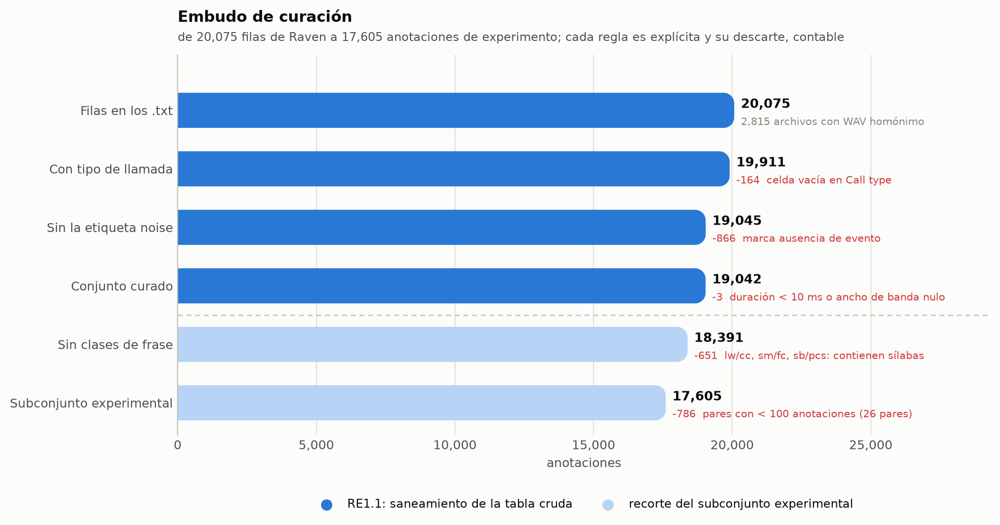
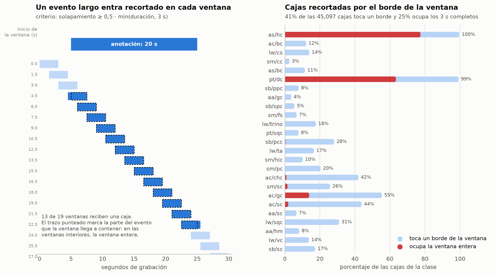
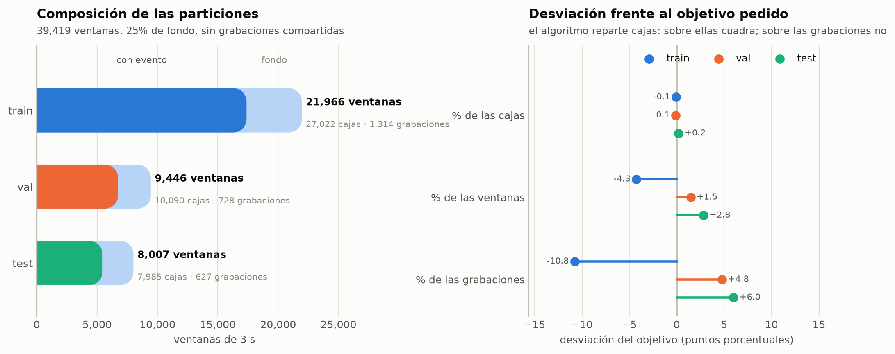
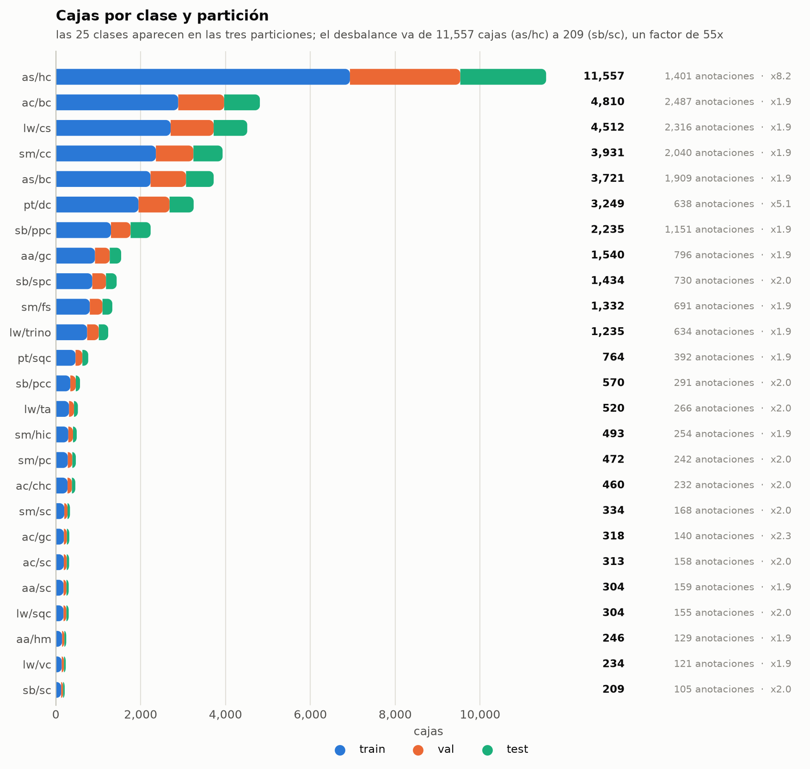
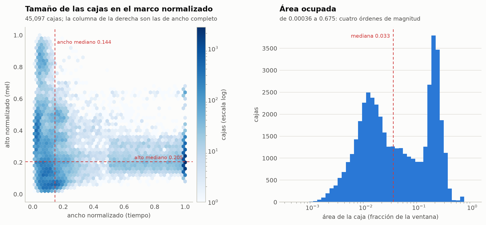

# Protocolo de curación y ficha del conjunto derivado (OE1)

**Objetivo específico 1.** Organizar y procesar las anotaciones de vocalizaciones para
construir un conjunto de datos estandarizado para detección de eventos
tiempo--frecuencia.

**Resultados que cubre este documento**

| RE | Resultado esperado | Sección |
|---|---|---|
| RE1.1 | Protocolo de curación y estandarización documentado | [§2](#2-re11-protocolo-de-curación-y-estandarización) |
| RE1.2 | Conjunto acústico curado y particionado para el experimento | [§3](#3-re12-ventaneo-partición-y-materialización) |
| RE1.3 | Ficha del conjunto derivado | [§4](#4-re13-ficha-del-conjunto-derivado) |

**Medios de verificación.** El código de `src/domain/annotations.py`,
`src/domain/species.py`, `src/domain/dataset.py`, `src/utils/audio.py`,
`src/core/config.py` y `src/create_dataset.py`; los artefactos de `data/processed/`; el
cuaderno `notebooks/re1_dataset_figures.ipynb` y el archivo `re1_stats.json` que
ese cuaderno escribe.

**Estado.** Todas las cifras de este documento corresponden al conjunto materializado el
20 de agosto de 2026 en `data/processed/`, y fueron recalculadas desde los `.txt` de
Raven por el mismo camino de código que usa `src/create_dataset.py`. No hay ningún
número transcrito a mano: cada uno sale de `re1_stats.json`.

---

## 1. Alcance, insumos y reproducibilidad

### 1.1 Qué produce este proceso y qué no

El proceso transforma **grabaciones WAV y tablas de selección de Raven** en un conjunto
derivado de **ventanas acústicas de longitud fija con cajas tiempo--frecuencia
normalizadas**, listo para entrenar un detector de conjunto (`ASTDeformableDETR`).

No modifica, no reetiqueta y no redistribuye el material primario. Las grabaciones
originales quedan intactas bajo `data/cleaned/`; todo lo que el protocolo decide se
expresa como código y como metadatos, nunca como una edición manual del archivo de
origen. Esa es la propiedad que hace del protocolo un procedimiento reaplicable: cuando
una regla cambia, se vuelve a correr sobre los datos primarios y el conjunto derivado se
reconstruye entero.

### 1.2 Material de partida

`data/cleaned/` contiene ocho directorios, uno por especie, con el patrón
`<nombre_común>__<CÓDIGO>` (por ejemplo `night_monkey__AA`). Cada directorio guarda
grabaciones `.wav` y, junto a algunas de ellas, un archivo de anotaciones `.txt`
delimitado por tabulaciones tal como lo exporta Raven.

| Especie | Código | Grabaciones | Horas de audio | Grabaciones con anotación |
|---|---|---:|---:|---:|
| *Alouatta sara* | AS | 807 | 7,54 | 778 |
| *Sapajus macrocephalus* | SM | 659 | 6,13 | 582 |
| *Ateles chamek* | AC | 560 | 6,06 | 382 |
| *Leontocebus weddelli* | LW | 529 | 5,27 | 409 |
| *Plecturocebus toppini* | PT | 375 | 3,35 | 320 |
| *Saimiri boliviensis* | SB | 290 | 3,08 | 256 |
| *Aotus azarae* | AA | 114 | 1,08 | 81 |
| *Cebus cuscinus* | CC | 16 | 0,11 | 7 |
| **Total** | | **3 350** | **32,63** | **2 815** |

De los **2 831** archivos `.txt` presentes, **2 815** tienen una grabación homónima al
lado y entran al proceso; **16** quedan huérfanos y se omiten. Ningún archivo produjo un
error de lectura en la corrida documentada aquí.

### 1.3 Entorno y comando

El proceso corre con Python `>=3.12` y las dependencias declaradas en `pyproject.toml`
(las relevantes para esta etapa son `pandas`, `numpy`, `torch`, `torchaudio`,
`soundfile` y `python-slugify`). Desde la raíz del proyecto:

```bash
uv sync                        # o: pip install -e .
python src/create_dataset.py
```

El script fija `SEED = 42`, crea `data/processed/` si no existe y **reemplaza** los cinco
artefactos que produce. La corrida completa materializa 39 419 espectrogramas mel y tarda
del orden de una hora en CPU; el resultado ocupa 6,2 GB.

### 1.4 Artefactos producidos

| Archivo | Tamaño | Contenido |
|---|---:|---|
| `data/processed/labels.json` | 427 B | Índice entero → nombre de clase, para las 25 clases |
| `data/processed/meta.json` | 699 B | Semilla, umbrales, exclusiones, normalización y todos los `Parameters` |
| `data/processed/train.pt` | 3,48 GB | 21 966 ventanas, imágenes, cajas y clases |
| `data/processed/val.pt` | 1,50 GB | 9 446 ventanas, imágenes, cajas y clases |
| `data/processed/test.pt` | 1,27 GB | 8 007 ventanas, imágenes, cajas y clases |

`data/processed/recording_durations.csv` acompaña a los anteriores con la duración de
las 3 350 grabaciones y la marca de si tienen anotación; es el insumo de las cifras de
§1.2 y no lo consume el entrenamiento.

### 1.5 Cómo se regeneran las cifras y las figuras de este documento

```bash
jupyter nbconvert --to notebook --execute --inplace notebooks/re1_dataset_figures.ipynb
```

El cuaderno recalcula el embudo de curación con un contador en cada regla, reconstruye
el manifiesto y la partición con la misma semilla, compara el resultado contra lo que hay
en `data/processed/`, escribe las cinco figuras `re1_*.png` en `research/figures/` y
vuelca todas las cifras en `re1_stats.json`.

Un segundo cuaderno, `notebooks/dataset_report.ipynb`, produce las figuras de composición
y geometría del conjunto (`annotations_per_pair`, `class_geometry`,
`class_geometry_facets`, `boxes_per_window`, `window_example`) que este documento también
cita.

---

## 2. RE1.1: protocolo de curación y estandarización

El protocolo es un *pipeline* programático, no una corrección manual. Se implementa en
`clean_annotations` y `load_annotations` (`src/domain/annotations.py`) y en
`select_experiment` (`src/create_dataset.py`). Las reglas se aplican en el orden que se
describe abajo, y ese orden importa: el recorte a Nyquist ocurre antes de calcular el
ancho de banda, y el descarte de ruido antes de la corrección de pares imposibles.

### 2.1 Recorrido de directorios y emparejamiento con el audio

`load_annotations` recorre `data/cleaned/` en orden alfabético y, para cada `.txt`:

1. Busca el `.wav` homónimo. Si no existe, el archivo se omite: una tabla de selección
   sin su grabación no aporta nada entrenable y suele indicar un error de transferencia.
2. Determina el directorio de especie subiendo por los ancestros de la ruta hasta
   encontrar el primero cuyo nombre contiene `__`.
3. Lee la tabla con `pandas.read_csv(..., sep="\t")` y añade la columna `audio_path` con
   la ruta absoluta del WAV.
4. Aplica `clean_annotations` y acumula el resultado.

Los errores de lectura se capturan por archivo y se registran con `logger.warning`: un
`.txt` corrupto o con un encabezado inesperado se omite sin detener el proceso.

### 2.2 Normalización de nombres de columna

Los encabezados originales pasan por `slugify(col, separator="_")`, que los reduce a
minúsculas, sin acentos y con guion bajo como separador.

| Encabezado de Raven | Columna normalizada |
|---|---|
| `Begin Time (s)` | `begin_time_s` |
| `End Time (s)` | `end_time_s` |
| `Low Freq (Hz)` | `low_freq_hz` |
| `High Freq (Hz)` | `high_freq_hz` |
| `Call type` / `Call Type` | `call_type` |
| `Inband Power (dB FS)` | `inband_power_db_fs` |

La alternancia entre `Call type` y `Call Type` observada en el material crudo se resuelve
por esta única regla, sin enumerar variantes.

Luego se descartan, si están presentes, las columnas que describen el estado interno de
Raven y no el evento: `selection`, `view`, `channel`, `reference`, `begin_file` y
`file_offset_s` (constante `DROP_COLUMNS`).

### 2.3 Origen de la especie

**La especie no se lee de la columna de la anotación, sino del directorio contenedor.**
Se toma el segmento posterior a `__` y se pasa a minúsculas, de modo que
`weddells_saddleBack_tamarin__LW` produce el código `lw`.

El criterio no es arbitrario: el directorio es un dato estructural, fijado una vez por
sesión de campo, mientras que la columna de especie se teclea en cada fila y es donde se
observaron discrepancias. Los ocho códigos posibles son `aa`, `ac`, `as`, `cc`, `lw`,
`pt`, `sb` y `sm`.

### 2.4 Normalización del tipo de llamada

El valor de `call_type` atraviesa tres pasos encadenados.

**(a) Normalización tipográfica.** `slugify(v, separator="_")` sobre cada valor de tipo
`str`; cualquier otro valor (incluido `NaN`) pasa a `None`. Este paso absorbe espacios
al final, mayúsculas inconsistentes, guiones y caracteres residuales.

**(b) Mapa de sinónimos manuales** (`MANUAL_SYNONYMS`), para las variantes que la
normalización tipográfica no captura porque son errores de escritura o abreviaturas
alternativas. La última columna es cuántas veces se aplicó en la corrida documentada:

| Valor normalizado | Código resultante | Aplicaciones |
|---|---|---:|
| `noises` | `noise` | 1 |
| `cs_a` | `cs` | 1 |
| `whinnie` | `whc` | 1 |
| `tca` | `ta` | 14 |
| `tac` | `ta` | 1 |
| `contact` | `cc` | 2 |
| `chcj` | `chc` | 7 |
| `php` | `phc` | 1 |
| `sqr` | `sqc` | 3 |
| `tc` | `tr` | 24 |

**(c) Nombres legibles declarados por especie.** Al mapa anterior se suma, para la
especie del directorio, la inversión de `CALL_TYPES`: el nombre legible del tipo de
llamada se traduce a su código. Así, las anotaciones escritas en prosa convergen con las
escritas en código: `contact_syllable` → `cs` (41 aplicaciones) y `contact_call` → `cc`
(9 aplicaciones).

En total, **105 registros** cambiaron de etiqueta por sinonimia.

### 2.5 Descarte de ruido y de registros sin etiqueta

Después de normalizar se eliminan dos categorías:

- **Sin tipo de llamada** (`call_type` nulo): 164 filas. La caja existe pero no dice qué
  hay dentro.
- **Etiqueta `noise`**: 866 filas. Marca la ausencia de evento, no un evento; entrenar
  con ellas como clase enseñaría al modelo a detectar «nada».

### 2.6 Corrección de pares imposibles y vocabulario cerrado

**Corrección determinista** (`MANUAL_FIXES`). Un conjunto explícito de reemplazos resuelve
pares que no existen en el repertorio de la especie y cuya intención es inequívoca. El
único vigente es `("aa", "hc") → ("aa", "hm")`: AA no tiene llamada de aullido
(*howl call*) pero sí de ululato (*hoot call*). Se aplicó a **23 registros**.

**Vocabulario cerrado.** `VALID_PAIRS` se deriva de `CALL_TYPES` y declara los 41 pares
(especie, tipo) admisibles del dominio, no lo que aparezca en los datos. Cada fila recibe
la columna booleana `requires_review = pair ∉ VALID_PAIRS`.

**Los pares fuera de vocabulario no se eliminan: se marcan.** La diferencia es
deliberada. Un par fuera de vocabulario puede ser un error de escritura no previsto o un
tipo de llamada legítimo aún no incorporado, y solo el equipo de investigación puede
distinguir uno de otro; descartarlos en silencio destruiría esa evidencia. Son **328
registros (1,7 %)** repartidos en 16 pares:

| Par | Registros | | Par | Registros |
|---|---:|---|---|---:|
| `as/cp` | 91 | | `as/cc` | 4 |
| `as/pp` | 85 | | `sm/sic` | 4 |
| `as/ip` | 73 | | `sb/phc` | 3 |
| `lw/a` | 20 | | `as/pc` | 3 |
| `lw/b` | 15 | | `sm/chc` | 3 |
| `sb/pcs` | 8 | | `lw/c` | 3 |
| `sm/hc` | 8 | | `sm/spc` | 1 |
| `aa/sqc` | 6 | | `pt/chc` | 1 |

Ninguno de ellos alcanza el umbral de selección de §2.8, de modo que la bandera basta:
en la configuración actual el filtro efectivo los deja fuera del experimento sin que
haga falta usar `requires_review` como criterio de descarte.

### 2.7 Saneamiento geométrico

Las coordenadas se validan de forma independiente de la etiqueta, en este orden:

1. `duration_s = end_time_s − begin_time_s`.
2. **Recorte a Nyquist**: `high_freq_hz` se acota a `MAX_FREQ_HZ = 22 050 Hz`. Por encima
   de ese límite no hay energía observable en una señal muestreada a 44,1 kHz, de modo
   que un valor mayor es un error de anotación. Afectó a **8 registros**.
3. `bandwidth_hz = high_freq_hz − low_freq_hz`, calculado **después** del recorte.
4. **Descarte de cajas degeneradas**: se exige `duration_s ≥ 0,01 s` y
   `bandwidth_hz > 0`. Una caja sin área no define una región y no puede emparejarse con
   ninguna predicción. Cayeron **3 registros**, que incumplían ambas condiciones a la vez.
5. Ordenamiento por `begin_time_s` y reindexado.

No hay una regla de deduplicación: el protocolo actual no elimina anotaciones repetidas,
y tampoco descarta automáticamente las filas con `requires_review = True`.

### 2.8 Selección del subconjunto experimental

`select_experiment` recorta el conjunto curado en tres pasos, en este orden:

**(a) Exclusión de pares de frase.** Se retiran `lw/cc` (517), `sm/fc` (126) y `sb/pcs`
(8), **651 anotaciones**. Las dos primeras son *frases* que contienen a una *sílaba* que
sí está en el experimento: el 99,6 % de las frases `lw/cc` contiene al menos una sílaba
`lw/cs`, y el 96,8 % de las `sm/fc` contiene una `sm/fs`. El detector devuelve una lista
plana de cajas y el emparejamiento húngaro asocia cada anotación con exactamente una
predicción, sin manera de expresar que «esta caja contiene a aquella»; conservar ambos
niveles equivaldría a pedir al modelo que informe dos veces el mismo sonido. `sb/pcs` es
un par fuera de vocabulario, casi con certeza un error de escritura de `sb/pcc`, que se
retira explícitamente para que no arrastre ruido a una clase vecina.

**(b) Elevación de la frecuencia inferior.** `low_freq_hz` se lleva al piso `f_min = 25 Hz`
del banco mel. **1 839 anotaciones** declaraban una frecuencia inferior por debajo de ese
piso, y **1 692 de ellas exactamente 0 Hz**, un valor que el eje mel no puede representar.

**(c) Unión de la familia de trinos de LW.** `lw/tr` (333), `lw/tj` (164), `lw/tt` (106) y
`lw/tf` (31) se unifican bajo `lw/trino`, **634 anotaciones**. Los cuatro comparten banda
y duración casi por completo —son variantes del mismo trino distinguidas por el orden y
la longitud relativa de sus sílabas—, y por separado ninguno reunía material suficiente.

**(d) Umbral de inventario.** De los 51 pares candidatos que quedan, se conservan los que
tienen al menos `MIN_PAIR_COUNT = 100` anotaciones. Sobreviven **25**; los 26 restantes
suman **786 anotaciones** y quedan fuera del experimento aunque permanecen en el conjunto
curado. Entre ellos cae `cc/cc`, con 29 anotaciones, que es el único tipo de llamada de
*Cebus cuscinus*: **la especie CC no participa del experimento**.

La etiqueta de clase se construye como `species/call_type` (`LABEL_BY`). La alternativa de
usar solo el tipo de llamada haría colapsar en una sola clase abreviaturas homónimas de
especies distintas —`cc` es *contact call* en AC, en CC y en SM—, y la de usar solo la
especie renunciaría al tipo de llamada, que es justamente lo que el analista necesita.

### 2.9 El embudo completo, con conteos

| Paso | Regla | Retirados | Quedan |
|---|---|---:|---:|
| Filas leídas | 2 815 archivos `.txt` con WAV homónimo | — | 20 075 |
| Sin tipo de llamada | `call_type` nulo | 164 | 19 911 |
| Ruido | etiqueta `noise` | 866 | 19 045 |
| Cajas degeneradas | duración < 10 ms o ancho de banda ≤ 0 | 3 | **19 042** |
| Clases de frase | `lw/cc`, `sm/fc`, `sb/pcs` | 651 | 18 391 |
| Umbral de inventario | pares con < 100 anotaciones (26 pares) | 786 | **17 605** |

Las cuatro primeras filas son RE1.1 propiamente dicho: sanean la tabla cruda. Las dos
últimas no corrigen datos, recortan el alcance del experimento.



**Figura 1.** Embudo de curación. Cada barra es lo que sobrevive a la regla de su fila;
en rojo, lo que la regla retira y por qué.

En medio del embudo, sin cambiar el conteo, actúan las reglas de reescritura: 105
etiquetas renombradas por sinonimia, 23 pares corregidos por `MANUAL_FIXES`, 8 frecuencias
recortadas a Nyquist, 1 839 frecuencias inferiores elevadas al piso mel y 634 anotaciones
reasignadas a `lw/trino`.

### 2.10 El conjunto curado

| Propiedad | Valor |
|---|---|
| Anotaciones | 19 042 |
| Grabaciones representadas | 2 789 |
| Especies | 8 |
| Pares (especie, tipo) distintos | 57 (41 en vocabulario, 16 fuera) |
| Marcados `requires_review` | 328 (1,7 %) |
| Duración: mín / mediana / máx | 0,034 s / 0,343 s / 73,3 s |
| Ancho de banda: mín / máx | 224 Hz / 21 784 Hz |
| Horas de evento delimitado | 8,60 h sobre 32,63 h de grabación (26,4 %) |

El rango de duración —un factor de **2 134×** entre el evento más corto y el más largo—
es la propiedad que gobierna todas las decisiones de las secciones siguientes. Para
comparar: en COCO, la colección con la que se evalúan habitualmente los detectores de
objetos, los objetos mayores superan a los menores en un factor de entre 10 y 100.

### 2.11 Indicadores verificables de RE1.1

| Indicador del IOV | Dónde se cumple | Evidencia |
|---|---|---|
| Normalización de columnas | §2.2 | `slugify` sobre los encabezados; `DROP_COLUMNS` |
| Normalización de etiquetas | §2.4 | `slugify`, `MANUAL_SYNONYMS`, inversión de `CALL_TYPES` |
| Mapa de sinónimos | §2.4 | Tabla de 10 entradas con sus 105 aplicaciones |
| Descarte de ruido | §2.5 | Filtro de `noise` y de nulos: 1 030 filas |
| Descarte de cajas degeneradas | §2.7 | `duration_s ≥ 0,01 s` y `bandwidth_hz > 0`: 3 filas |
| Corrección de pares imposibles | §2.6 | `MANUAL_FIXES`: `aa/hc → aa/hm`, 23 registros |
| Recorte al límite de Nyquist | §2.7 | `high_freq_hz ≤ 22 050 Hz`: 8 registros |
| Tratamiento de registros fuera de vocabulario | §2.6 | `requires_review`: 328 registros en 16 pares, marcados y conservados |

---

## 3. RE1.2: ventaneo, partición y materialización

### 3.1 Ventaneo

El detector consume entradas de tamaño fijo y las grabaciones tienen duración variable,
de modo que cada grabación se recorre con ventanas solapadas. `window_starts` produce los
inicios:

```python
if duration_s <= clip_len_s:          # 3,0 s
    return [0.0]
n_hops = ceil((duration_s - clip_len_s) / clip_hop_s - 1e-9)   # clip_hop_s = 1,5 s
return [k * clip_hop_s for k in range(n_hops + 1)]
```

El término `-1e-9` evita que una grabación que termina justo en un múltiplo del salto
agregue una ventana final de puro relleno. La última ventana puede sobrepasar el final del
archivo; el faltante se completa según §4.4.

Sobre las 2 669 grabaciones del subconjunto experimental, el recorrido produce **57 534
ventanas** de 3 s.

### 3.2 Asignación de anotaciones a ventanas

Para cada ventana, `_boxes_in_window` decide qué anotaciones entran:

```python
overlap = min(end, clip_start + clip_len_s) - max(begin, clip_start)   # clip_len_s = 3.0
visible = min(end - begin, clip_len_s)
keep    = (overlap > 0) and (overlap >= min_overlap * visible)         # min_overlap = 0.5
```

La comparación es contra **`visible`, la parte del evento que cabe en una ventana**, no
contra su duración completa. La distinción decide el destino de los eventos largos:

- Con la duración completa como referencia, ningún evento de más de 6 s podría asignarse
  a ninguna ventana, porque no existe posición en la que la mitad de su duración quepa
  dentro. En el subconjunto experimental eso habría dejado fuera 1 526 anotaciones
  (el 8,7 %), concentradas en `as/hc` y `pt/dc`.
- Con la parte visible como referencia —la regla vigente desde el *commit* `3c76d20`—
  un evento largo entrega **una caja recortada en cada ventana que contenga al menos
  1,5 s de él**. Ninguna clase se pierde por longitud.

El precio de la regla vigente es que la caja deja de delimitar el evento: en las ventanas
interiores de un aullido, la caja ocupa la ventana entera y solo declara que la ventana
está *dentro* de un evento. De las 45 097 cajas del conjunto, el **40,6 % toca un borde
temporal** de su ventana y el **24,6 % ocupa los 3 s completos**; en `as/hc` esas
proporciones son 99,6 % y 77,4 %.



**Figura 2.** Izquierda: un evento de 20 s frente al ventaneo; 13 de las 19 ventanas
reciben una caja. Derecha: fracción de las cajas de cada clase que toca un borde de su
ventana y fracción que ocupa la ventana entera.

Cada ventana termina en uno de tres destinos:

| Destino | Ventanas | Criterio |
|---|---:|---|
| Positiva | 29 564 | Al menos una anotación supera el umbral de solapamiento |
| Fondo elegible | 25 628 | Ninguna anotación se solapa con la ventana |
| Descartada | 2 342 | Hay un evento presente que **no** alcanzó el umbral |

El tercer destino es una decisión explícita: una ventana que contiene parte de un evento
audible pero no lo suficiente para dibujar la caja no puede etiquetarse como fondo, porque
eso enseñaría al modelo a callar sobre un evento que sí está ahí. Se descarta entera.

### 3.3 Normalización de las coordenadas de la caja

Las coordenadas se llevan al marco `[0, 1]²` de la ventana:

- **Tiempo**: `x = (t − clip_start) / clip_len_s`, recortado a `[0, 1]`. Un evento que
  empieza antes de la ventana o termina después queda cortado en el borde.
- **Frecuencia**: `y = hz_to_y(f)`, que aplica la escala mel HTK
  `mel(f) = 2595 · log10(1 + f / 700)` y la normaliza entre `f_min = 25 Hz` y
  `f_max = 22 050 Hz`.

La caja se guarda como `(cx, cy, width, height, class_id)` y se descarta si su ancho o su
alto son menores que `MIN_BOX_SIZE = 1e-3` —es decir, 3 ms en tiempo o una milésima del
eje mel—, un tamaño con el que ninguna predicción puede emparejarse de forma estable.

El eje mel no es una decisión cosmética: concentra la mitad del alto de la imagen por
debajo de unos pocos kilohercios, donde caen las especies graves, a cambio de que cada
banda cubra cada vez más hercios conforme sube la frecuencia. Con esa transformación, una
misma caja significa lo mismo en píxeles que en pantalla, y eventos de escalas muy
distintas se vuelven comparables por IoU.

### 3.4 Ventanas de fondo

Un detector entrenado solo con ventanas que contienen eventos aprende a emitir siempre
algo. `build_manifest` incorpora ventanas sin ningún evento con `EMPTY_RATIO = 0,25`:

```python
n_empty = min(len(empty), round(len(positive) * empty_ratio / (1 - empty_ratio)))
keep    = numpy.random.default_rng(42).choice(len(empty), size=n_empty, replace=False)
```

Sobre 29 564 ventanas positivas, la fórmula pide 9 855 ventanas de fondo, que es el
**38,5 %** de las 25 628 elegibles, muestreadas sin reemplazo con la semilla 42. El
manifiesto final tiene **39 419 ventanas** con exactamente un 25,0 % de fondo.

Ese fondo procede de las mismas grabaciones anotadas, no de una muestra independiente del
paisaje acústico; la limitación se registra en §4.9.

### 3.5 Partición por archivo de grabación

`split_manifest` divide el manifiesto en entrenamiento, validación y prueba con
proporciones **60 / 22,5 / 17,5** y semilla 42. **La unidad de asignación es el archivo
WAV completo**, nunca la ventana: con un salto igual a la mitad del clip, dos ventanas
consecutivas comparten la mitad de su audio, y repartirlas por separado filtraría material
de entrenamiento hacia la partición de prueba.

El algoritmo, paso a paso:

1. Agrupa todas las ventanas por `audio_path` y cuenta las cajas de cada clase por archivo.
2. Baraja los archivos con `default_rng(42)`.
3. Calcula el objetivo por partición y clase: `target = ratios ⊗ total_por_clase`.
4. Recorre las clases **de la más rara a la más común** (`argsort` sobre el total). Dentro
   de cada clase, ordena los archivos aún sin asignar por número de cajas de esa clase,
   de mayor a menor: los que más mueven la aguja se deciden con el máximo de libertad.
5. Asigna cada archivo a la partición con **mayor déficit** de esa clase; en empate,
   a la que tenga mayor déficit de ventanas.
6. Los archivos que ninguna clase reclamó (los que solo aportan ventanas de fondo) se
   reparten al final por déficit de ventanas.

Recorrer las clases de la más rara a la más común es lo que garantiza que las 25 clases
aparezcan en las tres particiones: cuando se decide `sb/sc`, con 209 cajas en total, todas
las particiones siguen vacías y hay libertad para repartirla; si se decidiera al final, sus
pocos archivos ya estarían comprometidos por clases mayores.

| Partición | Grabaciones | Ventanas | Con evento | Fondo | Cajas | Clases |
|---|---:|---:|---:|---:|---:|---:|
| `train` | 1 314 | 21 966 | 17 381 | 4 585 | 27 022 | 25 |
| `val` | 728 | 9 446 | 6 734 | 2 712 | 10 090 | 25 |
| `test` | 627 | 8 007 | 5 449 | 2 558 | 7 985 | 25 |
| **Total** | **2 669** | **39 419** | **29 564** | **9 855** | **45 097** | **25** |

**Ninguna grabación aparece en más de una partición**, lo que se verifica por
construcción y se comprueba en el cuaderno.

Las proporciones logradas son:

| Unidad | `train` | `val` | `test` | Desviación máxima |
|---|---:|---:|---:|---:|
| Cajas | 59,9 % | 22,4 % | 17,7 % | 0,2 pp |
| Ventanas | 55,7 % | 24,0 % | 20,3 % | 4,3 pp |
| Grabaciones | 49,2 % | 27,3 % | 23,5 % | 10,8 pp |

Las proporciones son **objetivos de asignación, no garantías de igualdad exacta**. El
algoritmo optimiza el reparto de cajas por clase, y sobre esa unidad cuadra casi
perfectamente; las ventanas y las grabaciones se desvían porque un archivo es indivisible
y aporta un número variable de ambas. Los archivos con muchas cajas por ventana —una sola
grabación de aullidos aporta cientos de cajas— tiran de la partición de entrenamiento
hacia menos archivos y más contenido.



**Figura 3.** Izquierda: de qué se compone cada partición. Derecha: desviación de la
proporción lograda frente a la pedida, en puntos porcentuales.

### 3.6 Reparto por clase

| Clase | `train` | `val` | `test` | Cajas | Anotaciones | Cajas/anot. |
|---|---:|---:|---:|---:|---:|---:|
| `as/hc` | 6 933 | 2 601 | 2 023 | 11 557 | 1 401 | 8,25 |
| `ac/bc` | 2 886 | 1 082 | 842 | 4 810 | 2 487 | 1,93 |
| `lw/cs` | 2 706 | 1 014 | 792 | 4 512 | 2 316 | 1,95 |
| `sm/cc` | 2 359 | 884 | 688 | 3 931 | 2 040 | 1,93 |
| `as/bc` | 2 233 | 837 | 651 | 3 721 | 1 909 | 1,95 |
| `pt/dc` | 1 950 | 731 | 568 | 3 249 | 638 | 5,09 |
| `sb/ppc` | 1 300 | 463 | 472 | 2 235 | 1 151 | 1,94 |
| `aa/gc` | 924 | 347 | 269 | 1 540 | 796 | 1,93 |
| `sb/spc` | 860 | 323 | 251 | 1 434 | 730 | 1,96 |
| `sm/fs` | 801 | 299 | 232 | 1 332 | 691 | 1,93 |
| `lw/trino` | 739 | 274 | 222 | 1 235 | 634 | 1,95 |
| `pt/sqc` | 465 | 161 | 138 | 764 | 392 | 1,95 |
| `sb/pcc` | 342 | 129 | 99 | 570 | 291 | 1,96 |
| `lw/ta` | 312 | 117 | 91 | 520 | 266 | 1,95 |
| `sm/hic` | 295 | 111 | 87 | 493 | 254 | 1,94 |
| `sm/pc` | 283 | 106 | 83 | 472 | 242 | 1,95 |
| `ac/chc` | 276 | 104 | 80 | 460 | 232 | 1,98 |
| `sm/sc` | 200 | 76 | 58 | 334 | 168 | 1,99 |
| `ac/gc` | 191 | 71 | 56 | 318 | 140 | 2,27 |
| `ac/sc` | 188 | 71 | 54 | 313 | 158 | 1,98 |
| `aa/sc` | 183 | 68 | 53 | 304 | 159 | 1,91 |
| `lw/sqc` | 182 | 68 | 54 | 304 | 155 | 1,96 |
| `aa/hm` | 148 | 54 | 44 | 246 | 129 | 1,91 |
| `lw/vc` | 140 | 53 | 41 | 234 | 121 | 1,93 |
| `sb/sc` | 126 | 46 | 37 | 209 | 105 | 1,99 |

Dos lecturas de esta tabla:

- **Hay más cajas que anotaciones.** Con ventana de 3 s y salto de 1,5 s, una anotación
  corta cae típicamente en dos ventanas consecutivas, de ahí el factor ≈1,95 casi
  universal. Las excepciones son las clases de eventos largos: `as/hc` produce 8,25 cajas
  por anotación y `pt/dc`, 5,09.
- **El desbalance es severo y no es el de las anotaciones.** Entre `as/hc` (11 557 cajas)
  y `sb/sc` (209) hay un factor de **55×**, mayor que el factor de 13× que separa a las
  mismas clases en número de anotaciones: el ventaneo amplifica el desbalance a favor de
  las clases de eventos largos.



**Figura 4.** Cajas por clase y partición, con el número de anotaciones de origen y el
factor de multiplicación que introduce el ventaneo.

### 3.7 Materialización

`build_dataset` instancia `CallBoxDataset` sobre cada partición y recorre sus ventanas:
lee el audio, calcula el espectrograma mel y guarda la imagen y sus objetivos. El
resultado se serializa con `torch.save`:

```python
{
    "images": Tensor[N, 1, 128, 331],    # float32
    "boxes":  list[Tensor[n_i, 4]],      # cxcywh normalizado, float32
    "labels": list[Tensor[n_i]],         # id de clase, int64
}
```

Las 331 columnas salen de `n_frames = clip_len_samples // hop_length + 1 = 132 300 // 400 + 1`.
Las listas `boxes` y `labels` tienen una entrada por ventana; una ventana de fondo aporta
tensores vacíos, que es como el conjunto representa el fondo.

**Verificación contra lo recalculado.** El cuaderno abre los tres archivos con
`mmap=True` —lee la cabecera del tensor sin traer los gigabytes a memoria— y compara:

| Archivo | Forma de `images` | Ventanas | Cajas | Fondo | Clases | Coincide |
|---|---|---:|---:|---:|---:|:---:|
| `train.pt` | `[21966, 1, 128, 331]` | 21 966 | 27 022 | 4 585 | 25 | ✔ |
| `val.pt` | `[9446, 1, 128, 331]` | 9 446 | 10 090 | 2 712 | 25 | ✔ |
| `test.pt` | `[8007, 1, 128, 331]` | 8 007 | 7 985 | 2 558 | 25 | ✔ |

Los tres archivos cargan sin error, y el número de ventanas, de cajas, de ventanas de
fondo y de clases presentes coincide exactamente con lo que el cuaderno recalcula desde
los `.txt`. El orden de las 25 clases de `labels.json` también coincide con el que produce
`LabelSet` al reconstruirlo.

`meta.json` registra, además, la procedencia completa: semilla, `min_pair_count`,
`empty_ratio`, `label_by`, los pares excluidos, la normalización calculada sobre
entrenamiento y el `asdict` íntegro de `Parameters`.

### 3.8 Indicadores verificables de RE1.2

| Indicador del IOV | Dónde se cumple | Evidencia |
|---|---|---|
| Los archivos procesados cargan sin error | §3.7 | Tabla de verificación; `torch.load(..., weights_only=False)` |
| `meta.json` registra la semilla | §3.7 | `"seed": 42` |
| …el criterio de selección | §2.8, §3.7 | `"min_pair_count": 100`, `"label_by": "species/call_type"` |
| …las exclusiones | §2.8, §3.7 | `"excluded_pairs": [["lw","cc"],["sb","pcs"],["sm","fc"]]` |
| …la etiqueta usada | §3.7 | `"label_by": "species/call_type"` |
| …la normalización | §4.5, §3.7 | `"normalization": {"mean": 4.4561…, "std": 183.6589…}` |
| El código divide por archivo de grabación | §3.5 | `split_manifest` agrupa por `audio_path`; 0 grabaciones compartidas |
| Proporciones 60 / 22,5 / 17,5 | §3.5 | `ratios=(0.6, 0.225, 0.175)`; logrado 59,9 / 22,4 / 17,7 sobre cajas |
| No por ventanas aisladas | §3.5 | La unidad de asignación es el `audio_path` completo |

---

## 4. RE1.3: ficha del conjunto derivado

### 4.1 Identificación

| Campo | Valor |
|---|---|
| Nombre | Conjunto derivado de vocalizaciones de primates amazónicos, ventanas de 3 s |
| Versión | Generada el 20 de agosto de 2026 con `SEED = 42` |
| Productor | Fernando Nelson Candia Aroni — Pontificia Universidad Católica del Perú |
| Repositorio | <https://github.com/nhrot-fc/tesis-primate> |
| Fuente primaria | Grabaciones AudioMoth y anotaciones de Raven cedidas por el equipo de investigación |
| Tarea | Detección de eventos sonoros con cajas tiempo--frecuencia y clasificación multiclase |
| Unidad de ejemplo | Ventana de 3 s representada como espectrograma mel de 128 × 331 |
| Unidad de anotación | Caja `(cx, cy, w, h)` normalizada más un `class_id` |
| Tamaño | 39 419 ventanas (32,85 h de ventana), 45 097 cajas, 25 clases, 6,2 GB |
| Licencia de uso | Material primario del equipo de investigación; el conjunto derivado no se redistribuye por separado |

### 4.2 Especies

El vocabulario de dominio (`domain.species.Species`) declara ocho especies. Siete de ellas
tienen al menos una clase en el experimento; **CC queda fuera** porque su único tipo de
llamada reúne 29 anotaciones, por debajo del umbral de 100.

| Código | Nombre científico | Nombre común | Tipos en vocabulario | Anotaciones curadas | Clases en el experimento |
|---|---|---|---:|---:|---:|
| `aa` | *Aotus azarae* | Mono nocturno | 3 | 1 090 | 3 |
| `ac` | *Ateles chamek* | Maquisapa negro | 6 | 3 081 | 4 |
| `as` | *Alouatta sara* | Mono aullador boliviano | 2 | 3 566 | 2 |
| `cc` | *Cebus cuscinus* | Machín blanco | 1 | 29 | 0 |
| `lw` | *Leontocebus weddelli* | Pichico de Weddell | 11 | 4 161 | 5 |
| `pt` | *Plecturocebus toppini* | Tocón de Toppin | 5 | 1 157 | 2 |
| `sb` | *Saimiri boliviensis* | Mono ardilla boliviano | 5 | 2 337 | 4 |
| `sm` | *Sapajus macrocephalus* | Machín negro | 8 | 3 621 | 5 |

### 4.3 Vocabulario del experimento

Las 25 clases, con el nombre legible declarado en `CALL_TYPES` y su inventario. El
`class_id` es el índice de `labels.json`, que se asigna por orden alfabético de la etiqueta.

| `class_id` | Clase | Tipo de llamada | Anotaciones | Cajas |
|---:|---|---|---:|---:|
| 0 | `aa/gc` | *gulp call* — llamada de trago | 796 | 1 540 |
| 1 | `aa/hm` | *hoot call* — ululato | 129 | 246 |
| 2 | `aa/sc` | *squeak call* — chirrido | 159 | 304 |
| 3 | `ac/bc` | *bark call* — ladrido | 2 487 | 4 810 |
| 4 | `ac/chc` | *chitter call* — parloteo | 232 | 460 |
| 5 | `ac/gc` | *growl call* — gruñido | 140 | 318 |
| 6 | `ac/sc` | *squeak call* — chirrido | 158 | 313 |
| 7 | `as/bc` | *bark call* — ladrido | 1 909 | 3 721 |
| 8 | `as/hc` | *howl call* — aullido | 1 401 | 11 557 |
| 9 | `lw/cs` | *contact syllable* — sílaba de contacto | 2 316 | 4 512 |
| 10 | `lw/sqc` | *squeal call* — chillido | 155 | 304 |
| 11 | `lw/ta` | *terrestrial alarm call* — alarma terrestre | 266 | 520 |
| 12 | `lw/trino` | Trino: unión de `tr`, `tf`, `tj` y `tt` | 634 | 1 235 |
| 13 | `lw/vc` | *visual contact call* — contacto visual | 121 | 234 |
| 14 | `pt/dc` | *duet call* — dueto | 638 | 3 249 |
| 15 | `pt/sqc` | *squeal call* — chillido (no oficial) | 392 | 764 |
| 16 | `sb/pcc` | *peep contact call* — contacto | 291 | 570 |
| 17 | `sb/ppc` | *play peep call* — juego | 1 151 | 2 235 |
| 18 | `sb/sc` | *shriek call* — grito de angustia | 105 | 209 |
| 19 | `sb/spc` | *spit call* — escupido | 730 | 1 434 |
| 20 | `sm/cc` | *contact call* — llamada de contacto | 2 040 | 3 931 |
| 21 | `sm/fs` | *food syllable* — sílaba de comida | 691 | 1 332 |
| 22 | `sm/hic` | *hip call* — alarma terrestre | 254 | 493 |
| 23 | `sm/pc` | *purr call* — ronroneo | 242 | 472 |
| 24 | `sm/sc` | *squeal call* — chillido | 168 | 334 |

El significado etológico de cada tipo de llamada y el criterio con que el analista dibuja
la caja en Raven están documentados en [`docs/call_type_notes.md`](call_type_notes.md).
Ese documento es parte del protocolo: define qué es la unidad anotada —sílaba aislada,
secuencia completa, con o sin armónicos— y por tanto qué está pidiendo el conjunto que el
modelo reproduzca.

### 4.4 Cadena de audio

`read_clip` (`src/utils/audio.py`) produce la forma de onda de una ventana:

1. Abre el WAV con `soundfile` y se posiciona en `int(clip_start_s · sample_rate)`.
2. Lee `int(clip_len_s · sample_rate)` muestras en `float32`, siempre en 2D (3 s).
3. Promedia los canales: el conjunto es monofónico.
4. Si la frecuencia nativa difiere de `target_sr = 44 100 Hz`, remuestrea con
   `torchaudio.functional.resample`.
5. Completa el faltante con `waveform_padding`.

**Relleno.** Con `pad_mode = "noise"`, el faltante se llena con ruido gaussiano escalado
por el cuantil 0,1 de la amplitud absoluta del fragmento: un piso de ruido plausible en
lugar del silencio digital perfecto, que no existe en una grabación de campo y que el
modelo aprendería a reconocer como «final de archivo». El generador se inicializa con
`pad_seed = 0`, de modo que el relleno es reproducible. Solo la última ventana de cada
grabación necesita relleno.

### 4.5 Representación tiempo--frecuencia

`MelSpectrogram` envuelve a `torchaudio.transforms.MelSpectrogram`:

| Parámetro | Valor | Equivalencia |
|---|---:|---|
| `target_sr` | 44 100 Hz | Nyquist en 22 050 Hz |
| `n_fft` | 4 096 | Resolución de 10,8 Hz por *bin* |
| `win_length` | 1 024 | Ventana de análisis de 23,2 ms |
| `hop_length` | 400 | Paso de 9,07 ms → 331 columnas |
| `n_mels` | 128 | Filas de la imagen |
| `f_min` / `f_max` | 25 / 22 050 Hz | Extremos del banco mel |
| `mel_scale` | `htk` | `2595 · log10(1 + f/700)` |
| `power` | 2,0 | Espectrograma de potencia |

La ventana de análisis de 23,2 ms está por debajo de la duración del evento más corto del
corpus (34 ms), que es la condición para que el evento más breve ocupe al menos una
columna completa. `n_fft` mayor que `win_length` significa que la ventana se rellena con
ceros hasta 4 096 muestras: no añade resolución real, interpola el espectro para que el
banco mel de 128 bandas quede mejor condicionado en las bandas bajas.

**El artefacto es un mel de potencia, no un log-mel.** `MelSpectrogram.forward` no aplica
`log`, `log10` ni `AmplitudeToDB`: entrega la salida directa de `torchaudio`. La
compresión logarítmica del rango dinámico ocurre más tarde, dentro del modelo, en la capa
`TrainablePCEN`. La transformación logarítmica de `hz_to_y` es otra cosa: normaliza el eje
de frecuencia de las **cajas**, no la intensidad del espectrograma.

**Estadísticas de normalización.** `compute_mel_statistics` recorre por bloques de 256
todas las imágenes de entrenamiento y calcula media y desviación estándar globales en
`float64`:

```json
{"mean": 4.456139367385734, "std": 183.65886631971313}
```

Se guardan en `meta.json` como metadato informativo y como huella del caché.
`CachedCallBoxDataset` **no** las aplica al cargar: la estandarización de la entrada la
hace el modelo con su `BatchNorm2d` posterior al PCEN. Que la desviación estándar sea 41
veces la media es la señal de que un mel de potencia sin comprimir tiene una cola larguísima,
y la razón de que la compresión sea imprescindible aguas abajo.

### 4.6 Aumento de datos

El único aumento implementado es `BoxJitter`, y actúa **sobre las cajas objetivo, no sobre
el audio ni sobre la imagen**. Se aplica en `CachedCallBoxDataset` únicamente cuando se
construye la partición de entrenamiento; validación y prueba se evalúan contra las cajas
sin perturbar.

| Parámetro | Valor | Efecto |
|---|---:|---|
| `scale` | 0,15 | Ancho y alto se multiplican por un factor uniforme en `[0,85; 1,15]` |
| `shift` | 0,10 | El centro se desplaza en tiempo hasta un 10 % del ancho perturbado |
| `min_size` | 0,02 | Piso del tamaño tras la perturbación |

Después de perturbar, los bordes se recortan a `[0, 1]` **y se preserva la adherencia al
borde**: una caja que ya tocaba el inicio o el final de la ventana lo sigue tocando. Sin
esa salvaguarda, el jitter separaría del borde justamente a las cajas recortadas de §3.2
y le enseñaría al modelo que un evento que continúa fuera de la ventana termina dentro
de ella.

La justificación del aumento es la incertidumbre real de la anotación: la frontera de un
evento acústico es difusa incluso entre anotadores, y perturbar la caja objetivo impide
que el modelo sobreajuste a un trazo que no es más preciso que el jitter aplicado.

No hay ningún otro aumento. En particular, **no** están implementados *pitch shifting*,
*time stretching*, SpecAugment, mezcla con ruido de fondo ni *mixup*.

### 4.7 Diccionario de datos

**Tabla de anotaciones curadas** (salida de `load_annotations`, en memoria):

| Campo | Tipo | Descripción |
|---|---|---|
| `audio_path` | `str` | Ruta absoluta del WAV de origen. Define el grupo de partición |
| `begin_time_s`, `end_time_s` | `float` | Inicio y fin del evento, en segundos desde el comienzo del archivo |
| `low_freq_hz`, `high_freq_hz` | `float` | Extremos de la banda; el superior recortado a 22 050 Hz |
| `duration_s` | `float` | `end_time_s − begin_time_s` |
| `bandwidth_hz` | `float` | `high_freq_hz − low_freq_hz`, calculado tras el recorte |
| `species` | `str` | Código de especie tomado del directorio |
| `call_type` | `str` | Código normalizado del tipo de llamada |
| `requires_review` | `bool` | El par (especie, tipo) no está en `VALID_PAIRS` |
| `label` | `str` | `species/call_type`; solo en el subconjunto experimental |
| `inband_power_db_fs`, `rating` | `float`, `str` | Columnas heredadas de Raven, presentes de forma irregular; no se usan |

**Manifiesto** (`ClipWindow`, una entrada por ventana):

| Campo | Tipo | Descripción |
|---|---|---|
| `audio_path` | `str` | Grabación de origen |
| `clip_start_s` | `float` | Inicio de la ventana en la grabación |
| `duration_s` | `float` | Longitud de la ventana: 3,0 s |
| `boxes` | `float64[N, 5]` | `(cx, cy, w, h, class_id)`; las cuatro primeras en `[0, 1]` |

**Caché materializado** (`train.pt`, `val.pt`, `test.pt`):

| Clave | Tipo | Descripción |
|---|---|---|
| `images` | `float32[N, 1, 128, 331]` | Espectrograma mel de potencia por ventana |
| `boxes` | `list[float32[n_i, 4]]` | Cajas `cxcywh` normalizadas; tensor vacío si la ventana es fondo |
| `labels` | `list[int64[n_i]]` | `class_id` de cada caja, en `0..24` |

**`meta.json`**: `seed`, `min_pair_count`, `empty_ratio`, `label_by`, `excluded_pairs`,
`normalization.mean`, `normalization.std` y `params` (el volcado íntegro de `Parameters`).

### 4.8 Geometría de las cajas normalizadas

| Magnitud | Mínimo | Mediana | Máximo |
|---|---:|---:|---:|
| Ancho (fracción de 3 s) | 0,0091 | 0,144 | 1,000 |
| Alto (fracción del eje mel) | 0,0128 | 0,205 | 0,993 |
| Área (fracción de la ventana) | 0,00036 | 0,033 | 0,675 |
| Cajas por ventana positiva | 1 | 1 (media 1,53; p95 = 4) | 11 |



**Figura 5.** Ancho contra alto de las 45 097 cajas, y distribución del área. La
distribución del área es **bimodal**: un modo alrededor de 0,01 —los eventos breves, que
es la mayoría— y otro alrededor de 0,2, que son las cajas de ancho completo de §3.2.

El máximo de 11 cajas en una ventana, con un percentil 95 de 4, es la cifra que dimensiona
el presupuesto de consultas del decodificador: con 64 consultas hay margen de sobra sobre
la ventana más poblada, y ese margen se paga en predicciones que hay que suprimir.

### 4.9 Limitaciones conocidas

1. **Las proporciones del split son aproximadas.** El algoritmo optimiza el reparto de
   cajas y la unidad es el archivo indivisible; sobre grabaciones la desviación llega a
   10,8 puntos porcentuales (§3.5).
2. **Las cajas de los eventos largos no delimitan el evento.** El 24,6 % de las cajas
   ocupa la ventana entera (§3.2). Reconstruir el evento completo exige fusionar
   detecciones de ventanas contiguas, cosa que el pipeline de inferencia no hace: su
   supresión funciona sobre cajas solapadas, no adyacentes.
3. **El desbalance entre clases es de 55×** y el ventaneo lo amplifica respecto del
   desbalance de las anotaciones (§3.6).
4. **El fondo no es una muestra independiente del paisaje acústico.** Procede de las
   mismas grabaciones anotadas, en las que hay eventos de especies o tipos que el
   vocabulario no cubre y que la ventana registra como fondo (§3.4).
5. **La cobertura del vocabulario es parcial.** El umbral de 100 anotaciones y las
   exclusiones dejan fuera 26 pares, 786 anotaciones y la especie CC completa (§2.8).
6. **`requires_review` es una marca, no un filtro.** El flujo de selección no la usa como
   criterio; los 328 registros marcados quedan fuera del experimento por el umbral, no por
   la bandera (§2.6).
7. **El conjunto hereda la ambigüedad de la unidad de anotación.** En unos casos el
   analista etiquetó sílabas y en otros secuencias completas; la exclusión de las dos
   clases de frase resuelve el caso documentado, no el fenómeno general.
8. **El relleno con ruido es un artificio.** Afecta a la última ventana de cada grabación
   y puede introducir textura que no existe en la señal original (§4.4).
9. **La normalización estadística se registra pero no se aplica en la carga.** Quien use
   el caché fuera de `ASTDeformableDETR` debe estandarizar explícitamente (§4.5).
10. **No hay suite de pruebas automatizadas** que verifique el pipeline de datos; la
    verificación es el cuaderno de §1.5 (§6).

### 4.10 Indicadores verificables de RE1.3

| Indicador del IOV | Dónde se cumple |
|---|---|
| Describe las ocho especies | §4.2, con nombre científico, inventario y participación en el experimento |
| El vocabulario | §4.3, las 25 clases con su nombre legible; `docs/call_type_notes.md` para el criterio de anotación |
| La composición | §2.10, §3.5, §3.6 |
| El desbalance | §3.6, factor de 55× entre la clase mayor y la menor |
| El diccionario de campos | §4.7, para las tres representaciones |
| El ventaneo de 3 s con salto de 1,5 s | §3.1, §3.2 |
| La normalización | §3.3 para las cajas; §4.5 para la señal |
| Las exclusiones | §2.5, §2.8 |
| Las limitaciones conocidas | §4.9 |

> **Nota sobre el enunciado del IOV.** El indicador de RE1.3 pide describir «la
> normalización log-mel». El conjunto materializado guarda un **mel de potencia sin
> comprimir** y la compresión la aplica el modelo (§4.5). Se documenta lo que el código
> hace, no lo que el indicador anticipaba.

---

## 5. Matriz consolidada de verificación

| RE | Medio de verificación | Criterio de cumplimiento | Estado |
|---|---|---|---|
| RE1.1 | Este documento §2 y `src/domain/annotations.py` | Las reglas de normalización, mapeo, descarte, control de vocabulario y límites físicos están descritas, son trazables a constantes y funciones del código, y su efecto está contado | Cumplido |
| RE1.2 | `data/processed/` y `src/create_dataset.py` | Existen `labels.json`, `meta.json` y tres cachés PyTorch que cargan sin error; el manifiesto se divide por `audio_path` sin grabaciones compartidas; los parámetros quedan registrados | Cumplido |
| RE1.3 | Este documento §4, `meta.json` y `docs/call_type_notes.md` | Se documentan especies, vocabulario, composición, desbalance, diccionario de campos, ventaneo, representación, aumento y limitaciones | Cumplido |

---

## 6. Comprobaciones ejecutables

**Calidad estática del código del pipeline:**

```bash
.venv/bin/ruff check src/
.venv/bin/ty check
```

Ambos pasan sin hallazgos. `ruff check .` incluye además los cuadernos, que arrastran
avisos de estilo preexistentes (`B905`, `B007`) ajenos al pipeline.

**Verificación del artefacto** (no requiere GPU; `mmap=True` evita cargar los 6,2 GB):

```bash
.venv/bin/python - <<'PY'
import json, torch
from pathlib import Path

cache = Path("data/processed")
meta = json.loads((cache / "meta.json").read_text())
labels = json.loads((cache / "labels.json").read_text())
assert meta["seed"] == 42 and meta["min_pair_count"] == 100
assert len(labels) == 25

for name, ventanas, cajas in [("train", 21966, 27022), ("val", 9446, 10090), ("test", 8007, 7985)]:
    data = torch.load(cache / f"{name}.pt", map_location="cpu", mmap=True, weights_only=False)
    assert tuple(data["images"].shape) == (ventanas, 1, 128, 331), name
    assert sum(len(t) for t in data["labels"]) == cajas, name
    assert len(data["boxes"]) == len(data["labels"]) == ventanas, name
    print(f"{name}: {ventanas} ventanas, {cajas} cajas — OK")
PY
```

**Reproducción completa desde los datos primarios**, que además comprueba la ausencia de
fuga entre particiones y regenera las figuras:

```bash
jupyter nbconvert --to notebook --execute --inplace notebooks/re1_dataset_figures.ipynb
```

El proyecto **no tiene todavía una suite de `pytest`**, aunque `pyproject.toml` la deja
configurada (`[tool.pytest.ini_options] pythonpath = ["src"]`). Correr `pytest` hoy
recolecta cero pruebas; la verificación efectiva de RE1 es la de este apartado.

---

## 7. Diferencias respecto del Capítulo 4 de la tesis

El capítulo «Curación del Conjunto de Datos (OE1)» de `research/main.tex` describe una
configuración anterior del mismo pipeline. Al actualizarlo conviene corregir cinco puntos:

| Punto | En el capítulo | En el código y los artefactos actuales |
|---|---|---|
| Umbral de selección | 500 anotaciones → 10 clases | `MIN_PAIR_COUNT = 100` → **25 clases** |
| Proporciones del split | 70 / 10 / 20 | **60 / 22,5 / 17,5** |
| Composición del split | 1 667 grabaciones, 11 555 ventanas, 24 200 cajas | **2 669 grabaciones, 39 419 ventanas, 45 097 cajas** (incluye 9 855 de fondo) |
| Eventos de más de 6 s | «1 514 anotaciones inalcanzables, el 10,7 %» | La regla cambió en `3c76d20`: **ningún evento se pierde por longitud**; el costo ahora es el recorte al borde (§3.2) |
| Anotaciones curadas | 19 029 en 65 pares | **19 042 en 57 pares** |

La figura `research/figures/unreachable_events.png`, generada por
`notebooks/dataset_report.ipynb`, cuantifica el defecto que la regla anterior producía y
**ya no describe el conjunto vigente**; su lugar lo ocupa la Figura 2 de este documento.
